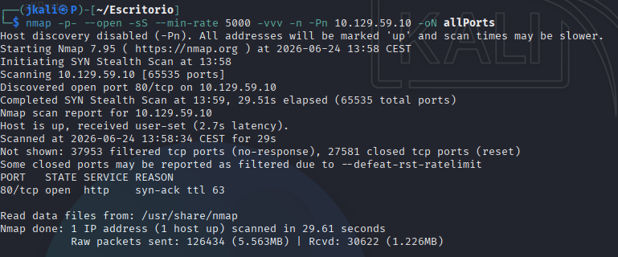
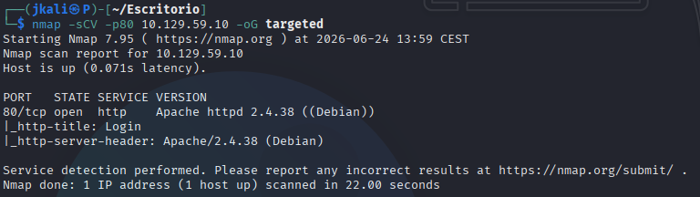

Welcome to my writeup version of the HTB machine Appointment.


# Enumeration

## NMAP

I start with nmap to see what ports are open and what services are running:




Now lets see deeper information about versions and services.



The only service unning is a HTTP port with the title "Login".

## HTTP

By searching the IP on a navigator we'll be presented with a login:


Inside this login we have the tipical thing we would expect from one, except the "forgot password" does nothing.

# Exploitation

The only thing we'll need to do is a simple SQLi(SQL injection) on the login:

```
admin ' OR 1=1 -- -
```

Using this in each field we'll be granted the flag.