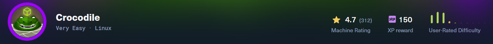
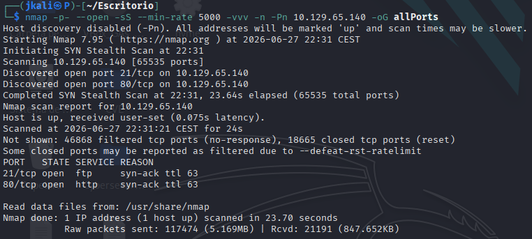
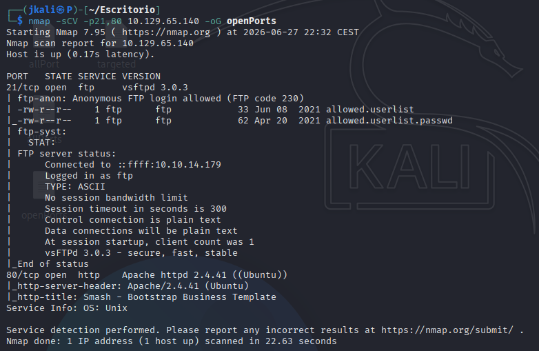
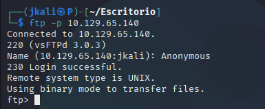
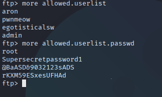
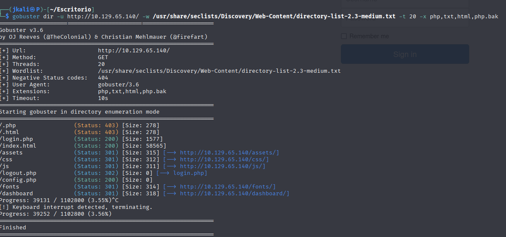
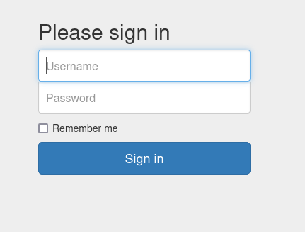
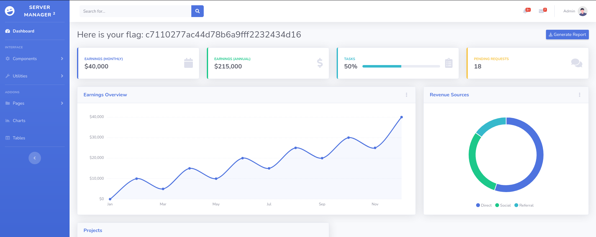

Welcome to my writeup version of the HTB machine crocodile.

# Enumeration

## NMAP

I start with nmap to see what ports are open and what services are running:

Now lets see deeper information about versions and services.

There are two ports open with their corresponding services:

    - Port 21: Its running an FTP. 
        It allows an "Anonymous" connection.
        It has some files which may contain sensible infotmation.

>An anonymous connection allows a user to connect without a password using the username Anonymous.

    - Port 80: Running an HTTP service.

# Footlhold

## FTP

We try to connect to the FTP service with "Anonymous":

Which we do succesfully.

Now let's try to see whats inside the files:
>With the command 'help' we can see which commands are available

>Also point out that this is not the correct way of reading the files. The right way would be to download them with `get`. In a real pentesting not doing so would probably be registered on a log or produce an alert.

Now that we have potential users with their passwords, the next step would be to try them on the HTTP service.

## HTTP

We are presented with a simple web page:

None of the features around the page do anything which could be interpreted as a vector of attack.

Therefore the next step is to look for directories or subdomains.

Inside a directory `/login.php` we'll find a login, in which we can use the credentials obtained before:

With the credentials admin:rKXM59ESxesUFHAd we are able to acces a dashboard containing the flag.

