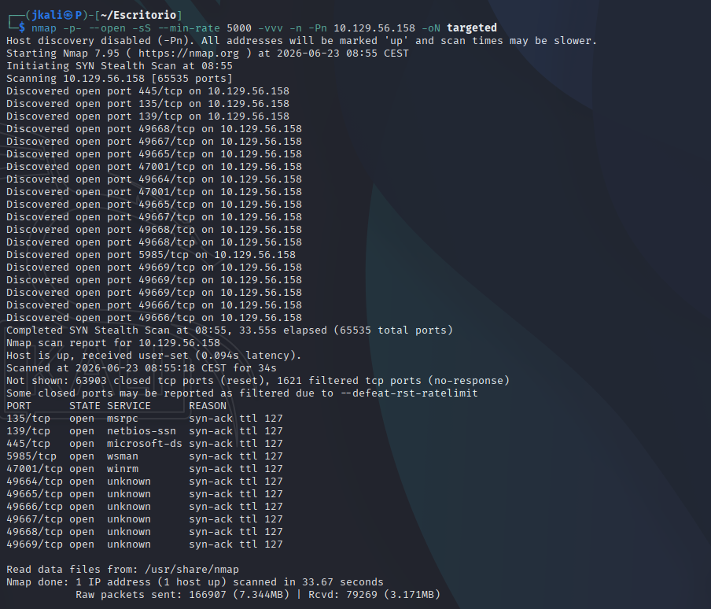
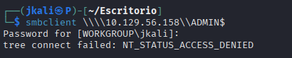
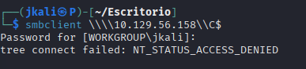
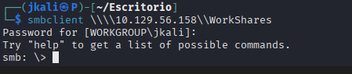
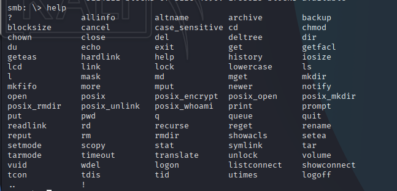
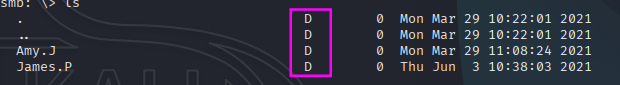
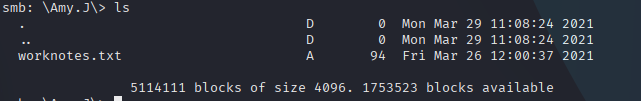
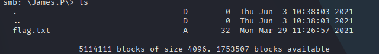

# Enumeration

## NMAP

I start with nmap to see what ports are open and what services are running:



Now lets see deeper information about versions and services.


```
135/tcp   - RPC      - Windows internal communication, not directly exploitable
139/445   - SMB      - File and printer sharing, high potential for enumeration
5985/tcp  - WinRM    - Windows Remote Management, allows remote command execution
47001/tcp - WinRM    - Alternative port for WinRM
```
With this information, the most obvious one is the SMB running on port 445. 
> It sticks out the service which port 445 is running, "microsoftds", which should contain shared files with sensible info

## SMB

>SMB (Server Message Block) is a network protocol that allows sharing files, printers, and other resources between computers within a network.

```
smbcclient -L <ip> -N
```


- The next step is to try accessing each shared data:

1. 


2. 


3. 


- The only data we have access to is 'WorkShares'. Let's see what's inside:

First of all, we need to see which comands are available with `help` comand.



Once we now the comands we can use, its time to navigate the shared resource.



It can be seen that there are some directories, inside there's:

Amy.J:  


James.P:  



> The <u>single</u> flag is inside the last enumerated directory