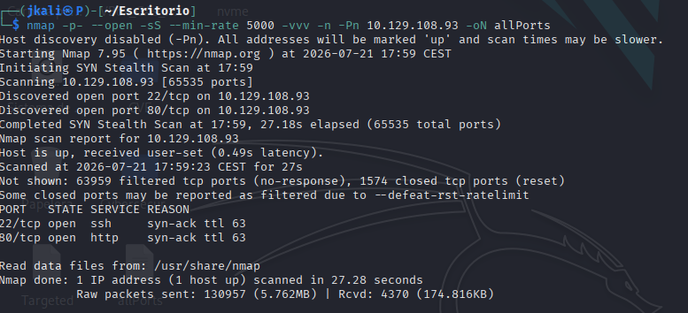

---

# TASK 1

# TASK 2  

- First step is to check on the open ports and services accessible:

The only services openned are a ssh(protocol to communicate between devices) and HTTP(a website).

## HTTP

By copying the ip on a navigator we come across the following website:

To learn about the path to the directory on the server which returns the login page, we can use a function inside *BurpSuite* called <u>proxy</u>, mentioned beffore.

