---

# TASK 1

# TASK 2  

- First step is to check on the open ports and services accessible:


The only services openned are a ssh(protocol to communicate between devices) and HTTP(a website).

## HTTP

By copying the ip on a navigator we come across the following website:


To learn about the path to the directory on the server which returns the login page, we can use a function inside *BurpSuite* called <u>proxy</u>, mentioned beffore.

## BurpSuite

> In case you haven't used burp until now, there are many tutorials on setting up the tool.

- Open Burp's browser

- With burpsuite well set we activate the proxy

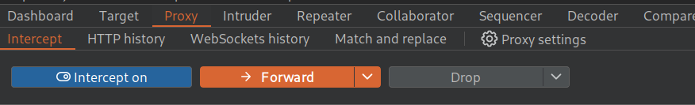

- Capture a petition by refreshing the page, then go to "target"

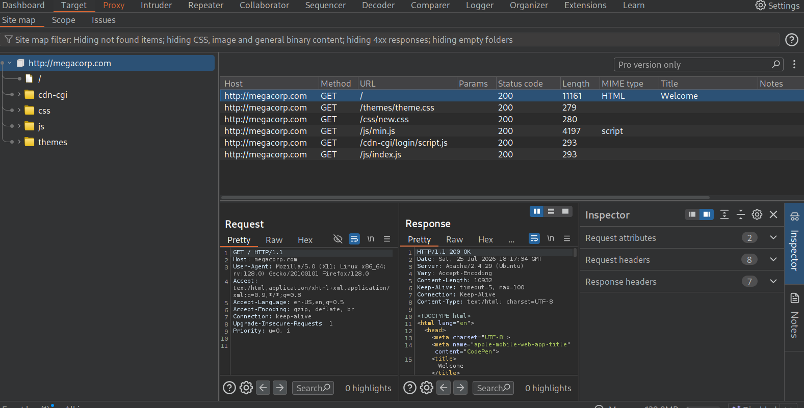

- Inside "target" we can see the path which would be charging the login, `http://megacorp.com/cdn-cgi/login/`

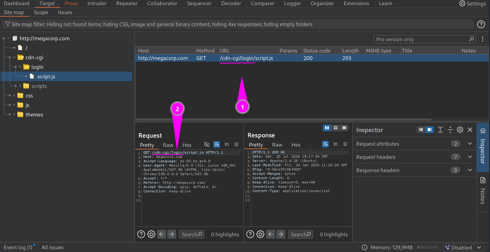

- With said path we may access the login page.

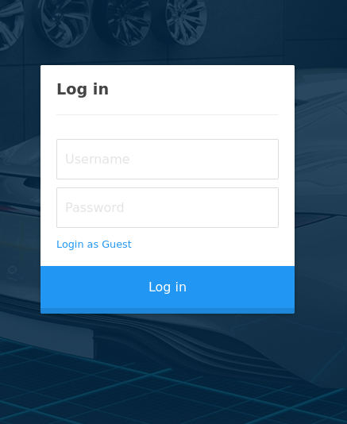

# TASK 3

- When going through with "Login as Guest" we enter inside a management page.

- When trying to see what the "uploads" page has, we are greated with:

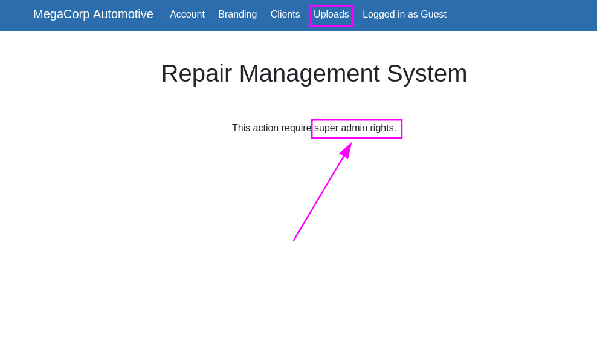

Usually there are different things you can change to log as admin.

In this case, inside the "Storage" section, inside "Cookies" we'll find that the cookies are on plain text.

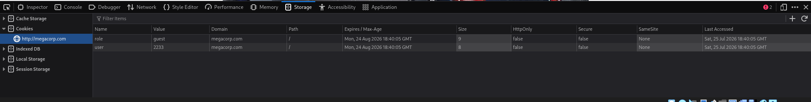

- On the "Account" section, the number of the ID is the same as the value of the cookie. 

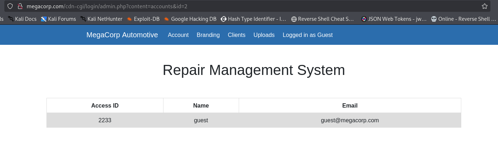

# TASK 4

- Looking at the URL it can be een that there is an "id" parameter. Changing its number to 1 will reveal the "admins" cookie value

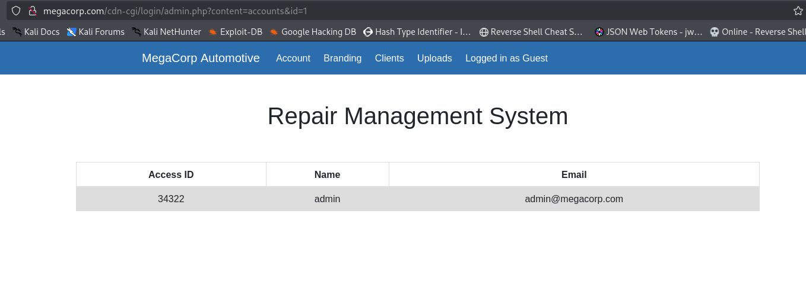

- With the cookie set to the admins value, we'll be able to see the contents of "uploads"

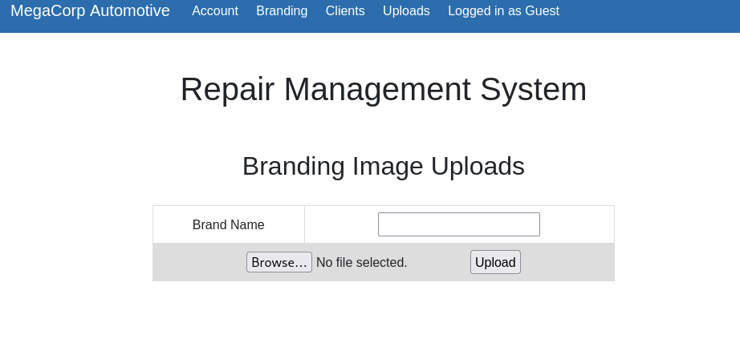

# TASK 5

- By using tools such as *Gobuster* we bruteforce the posible directories:

```
gobuster dir -u http://megacorp.com/ -w /usr/share/seclists/Discovery/Web-Content/directory-list-2.3-medium.txt -t 20 -x php,txt,html,php.bak
```

Then a directory `/uploads` comes out.

# TASK 6

- Uploading a webshell, which you can find in repositories like `https://github.com/BlackArch/webshells/blob/master/php/php-reverse-shell.php`

- Listening on the defined port `nc -lnvp <port>`

- earching the url of the file we uploaded `megacorp.com/uploads/<file>.php`

Then gain access to a shell.

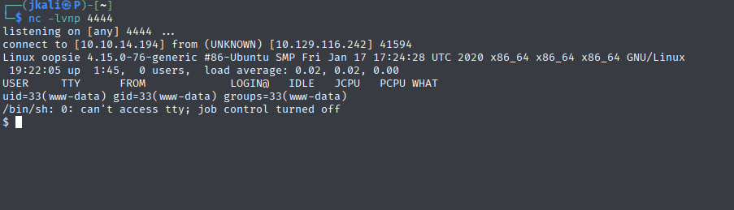

Inside a file on /var/www/cdg-in/login/ we'll find the password for robert.

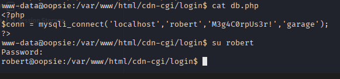

With `su robert` and the password we'll become the "robert" user.


# TASK 7

With `id`, we'll see that there is a group called "bugtraker".

`find / -group bugtracker 2>/dev/null`

# TASK 8

Searching for files with that group, we'll come a across:

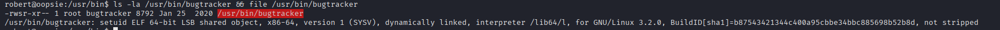

We see that the file has a SUID on the root user, which means a possibility of executing the file with root privileges.

# TASK 9

SUID -> "Set User ID" or "Set Owner User ID"

# TASK 10 

When executing the foung file, it tries to use a cat on a directory in `/root`

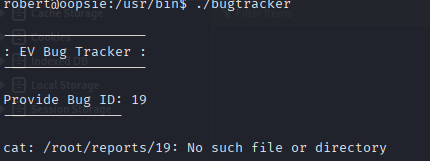

# ROOT

- Knowing that cat is being executed with root UID, a PATH highjacking migh give us root.

- Basically we'll include a file on /tmp called the same as what is being executed through /bugtracker. Then adding the directory /tmp on the PATH environmental variable, making OUR *cat* be executed before the original cat.

- Inside the new cat file, we add a line to spam a shell such as `/bin/sh`, which would spam a shell with root.


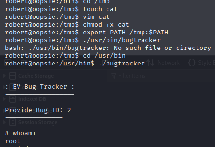

