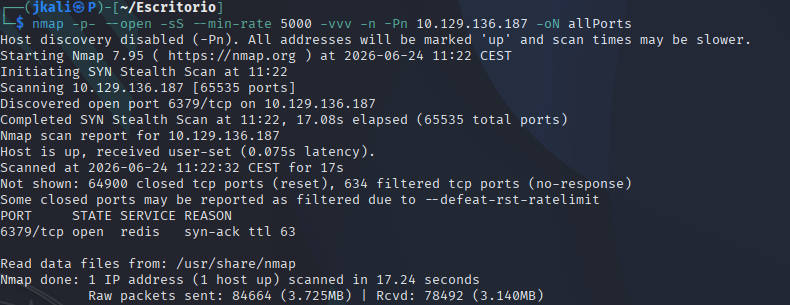
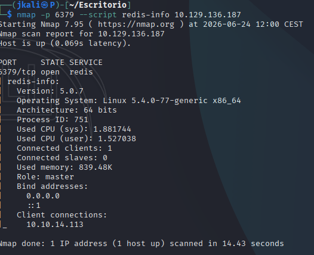
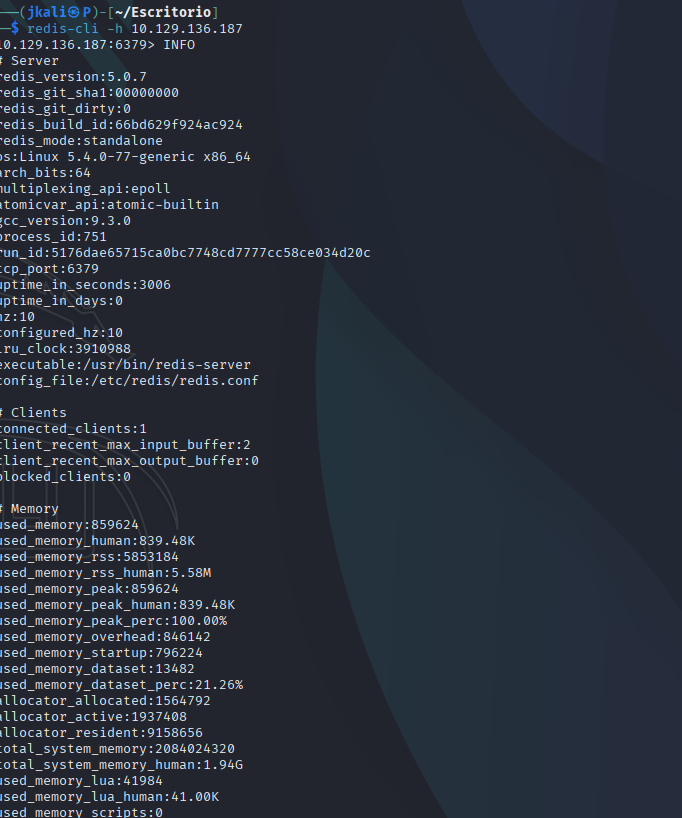
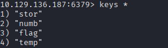

Welcome to my writeup version of the HTB machine Redeemer.


# Enumeration

## NMAP

First of all, lets enumerate which ports are open and which services are running with nmap.


><u>Redis</u> is an in-memory key-value database that runs by default on port 6379. It is often used for caching and message brokering, and can be highly valuable during enumeration due to potential misconfigurations or lack of authentication.

Then a second nmap to deepen on the services.

Seeing that with my usual go to  `nmap -sCV -p6379 10.129.136.187 -oG targeted`, I wasn't getting much more informatioonn, I decided to search for "[exploitation for port 6379 with redis](https://www.verylazytech.com/redis-port-6379)". Then I used the recommended nmap scann:



# Redis

Knowing that there is a data base as the only service on, the next step is to connect with the DB.
>In case you don't have the required tools for the enumeration, execute `sudo apt install redis-tools`


>In this image the command 'INFO' is used to check unauthenticated access and to get info about the DB.

As we can see one of the flaws of redis DB is that, unless specified, it allows unauthenticated access. In case there wasn't we could bruteforce the password.


## Info Enumeration

Once proven that auth is not needed, is time to enumerate information on the data base.

Aside of the command `INFO` we can search by sections:

```
127.0.0.1:6379> INFO server
127.0.0.1:6379> INFO clients
127.0.0.1:6379> INFO memory
127.0.0.1:6379> INFO persistence
127.0.0.1:6379> INFO stats
127.0.0.1:6379> INFO replication
127.0.0.1:6379> INFO cpu
127.0.0.1:6379> INFO keyspace
127.0.0.1:6379> INFO cluster
127.0.0.1:6379> INFO commandstats
```

- Useful info:
```
redis_version:5.0.7

os:Linux 5.4.0-77-generic x86_64

config_file:/etc/redis/redis.conf

used_memory_human:839.48K

role:master

Connected clients: 1

db0:keys=4,expires=0,avg_ttl=0
```

### Keys

Inside the database we are going to enumerate the keys inside:



One of the keys is called "flag". With the command `GET` you'll be able to see the content and finish the machine.