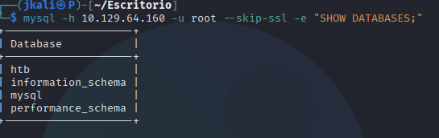
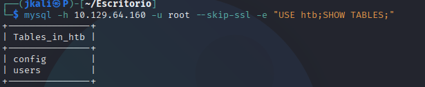
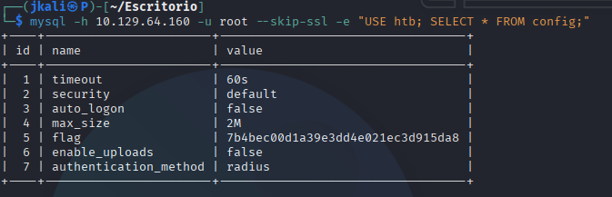

Welcome to my writeup version of the HTB machine Sequel.

# Enumeration

## NMAP

I start with nmap to see what ports are open and what services are running:

Now lets see deeper information about versions and services.

The result comes up as a MariaDB. 

# Foothold

I couldn't access to the database in a normal way, so I decided to skip the conexión and send the query straight to the database.

Then inspect the database "htb":

We see a "users" table, which may contain sensible information. Normally I would inspect that one, but seeing that we only have an instance of MySQL i'll inspect "config".

And thare we have the flag!