Welcome to my writeup versión of the HTB machiine CCTV.

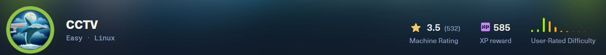

# Enumeration

## NMAP

Let's start with a nmap to list all the ports open and the services which are running in them.

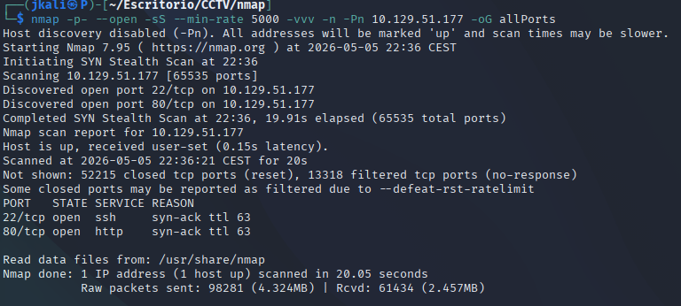

Then about the services

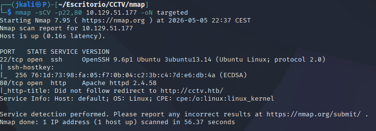

- Port 22: SSH port that we'll be seeing later.

- Port 80: HTTP port which redirects to http://cctv.htb/. We can see the version is an `Apache httpd 2.4.58`.

## HTTP

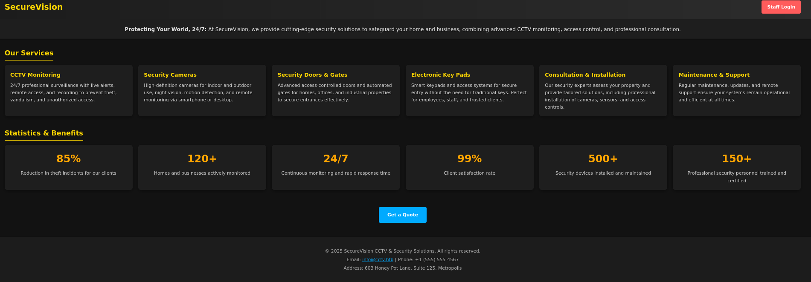

Inside the web page on port 80 we can see many things at first. From all the information given theres 3 things to point out:

1. There is a button which redirects you to a login(top right)
2. There is a button which sends an email<br>
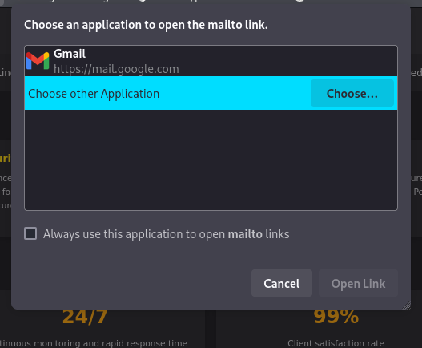
3. There is an email which maybe will be of use later.


### ZoneMinder

Lets take a look at the login.

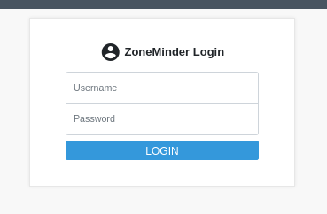

Its just a normal login.

By trying the typical `admin:admin` we can get through it.

After loging in we'll see another web page with a lot of different features.

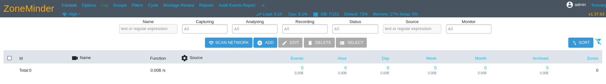

- Taking a look at all the options available:

1. <u>Console</u>>: Its the initial web page.

2. <u>Options</u>:

This menu option has a lot of posibilities.

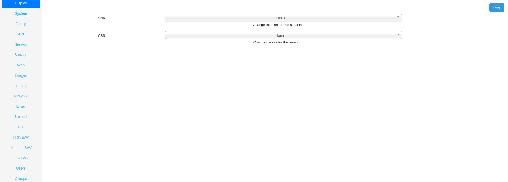
>There are some that can't be seen on the foto.

From all of them only options like "API" or "Users" seem usefull.

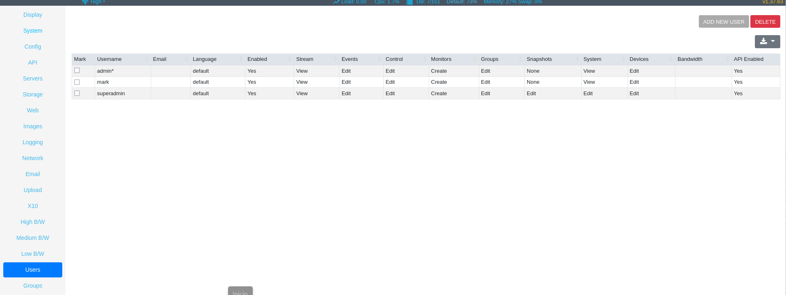

As it's telling us how many users there are, and therefore giving us other posible ways of vulnerating the machine.

3. <u>Logs</u>:

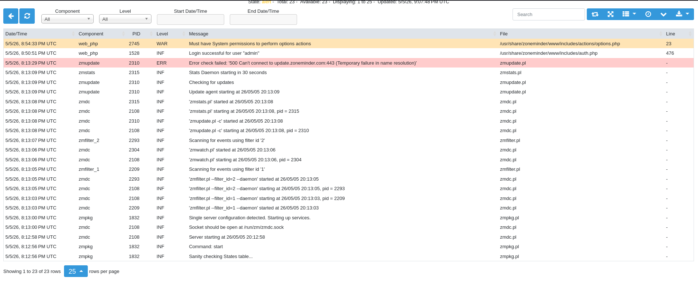

There's a lot of information here.

First there are exposed routs such as `/usr/share/zoneminder/www/includes/actions/options.php`

Second its trying to conect to a port 443 periodicaly, but it returns the error 

`Error check failed: '500 Can't connect to update.zoneminder.com:443 (Temporary failure in name resolution)'` 

which could hint us a posible conexion thats not visible from the outside with nmap.

And finally that there is php running.

4. etc.

The rest of the options are either empty or not usefull.

---  
<br>
At the top right of the web page, as well as in one of the menues in "options", we can see the version of the service. The name of the service an be fount in "options" mainly but also in other places across the web page.

`ZoneMinder v1.37.63` is the name and version of the service we are looking at.

Through a quick search on google I foung the exploit CVE-2024-51482. Which I could find on [Github](https://github.com/ZoneMinder/zoneminder/security/advisories/GHSA-qm8h-3xvf-m7j3), which should work for versions prior to v1.37.64.

### Exploit

When trying to run(sqlmap) im told that I need the correct HTTP authentification, therefore I asume I need the cookie to operate SQLmap.

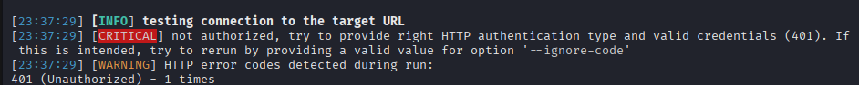

In this case what we need is the ZMSESSID on devtools(F12).

```
sqlmap -u 'http://cctv.htb/zm/index.php?view=request&request=event&action=removetag&tid=1' --cookie="ZMSESSID=<cookie>" 
```

Sqlmap finds that there is a time based sqli with the parameter tid being injectable.

With this knowledge I began enumerating the database.

```
sqlmap -u 'http://<IP>/zm/index.php?view=request&request=event&action=removetag&tid=1' --cookie="ZMSESSID=<cookie>" -p "tid" --batch --technique=T -D zm -T Users --dump
```

Which came with the result:

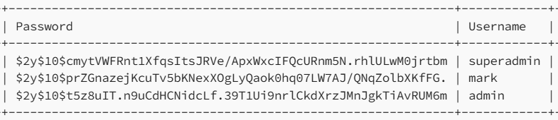
>the rest of the coulms are not in the foto, but we won't be needing them for now.

As the hashes start by `$2y`, its bycript. Decrypt them and we get:

During the process I found that only mark's hash can be decrypted. 

With the credentials mark:********** we'll be able to log as mark.

# Privilege Escalation

You would expect to find the user flag on the home/mark directoy, but its not there.

In the home directory we can see two directories for users.

```
mark@cctv:/home$ ls 
mark  sa_mark
```

At first, every way of enumeration  doesn't seem to show anything usefull. Then after looking at the processes running:

```
ps aux
netstat -tulnp 2>/dev/null || ss -tulnp
```

which result is

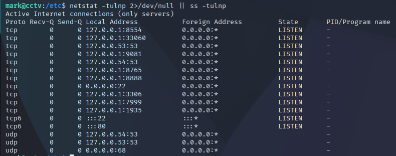

With a quick comparison with some services, we realiced that the port 8765 is the default port of MotionEye.

Searching on vulnerabilities for priviledge escalation. It seems there is an RCE for MotionEye, some CVE's needed doker comands but I couldnt use them.

After a while I found a directory /motioneye on /etc/. Then inside there is a file which has some credentials:

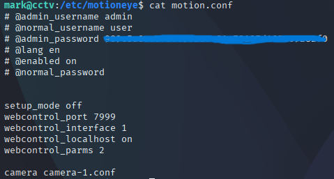

Then we stablish a pipeline to acces the MotionEye port:

```
ssh -L 8765:127.0.0.1:8765 mark@10.129.52.165
```

Then we acces the motionEye interface from a navigator.

```
http://127.0.0.1:8765/
```

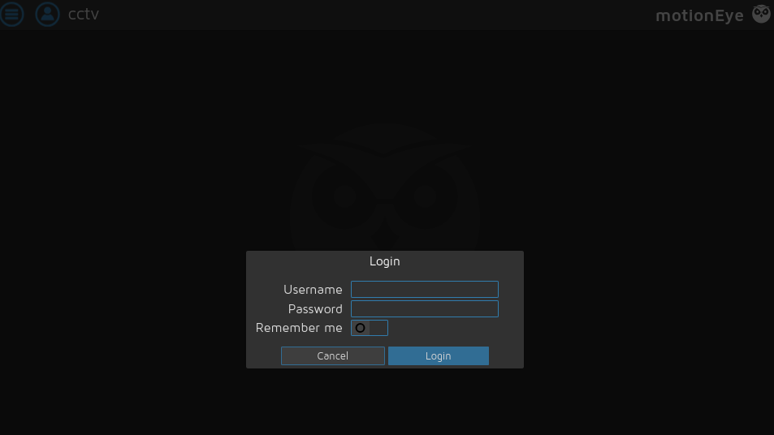

Then we login with the credentials we found before.

Inside we find a camera with some features:

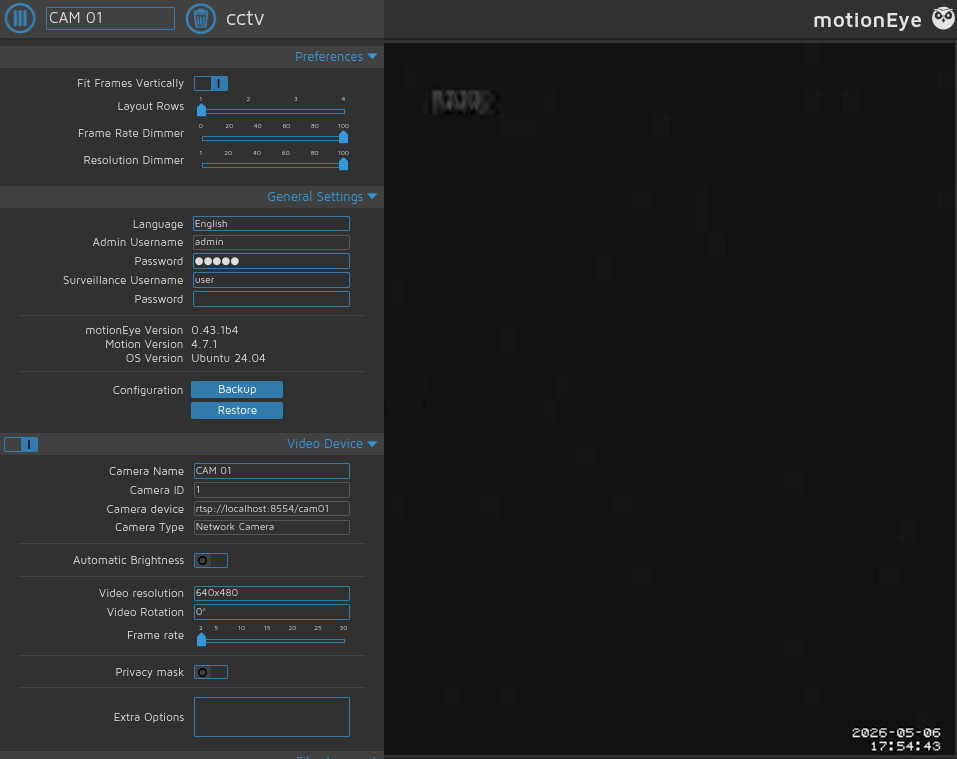


Then by looking at the version of motionEye, we are ablo to search for a vulnerability on the site on [github](https://github.com/motioneye-project/motioneye/security/advisories/GHSA-j945-qm58-4gjx). It turns out there a posible RCE.

Following the PoC of the CVE we acomplish root.

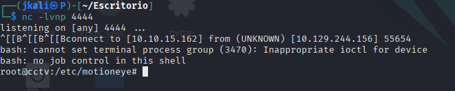

The only thing left is to go claim the flags.

