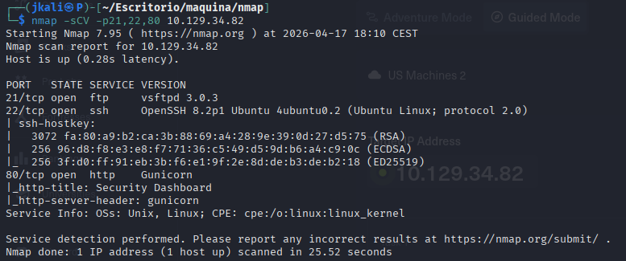
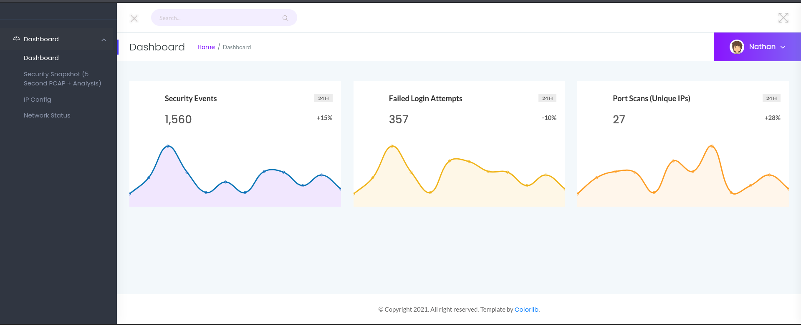
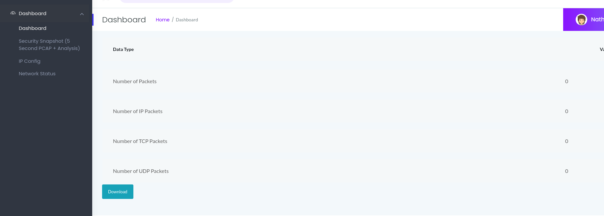
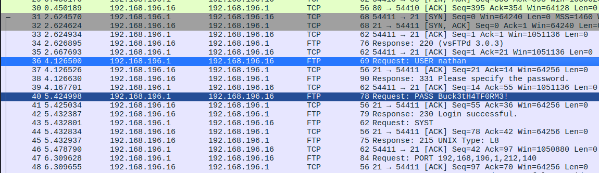
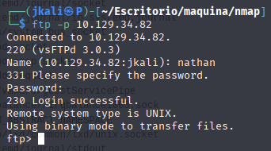
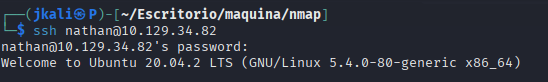
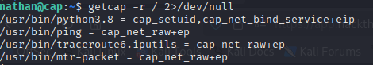
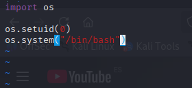
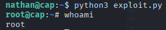

Welcome to my writeup version of the HTB machine Cap.

# Enumeration

## NMAP

I start with nmap to see what ports are open and what services are running:

Now lets see deeper information about versions and services.

We see a ftp server with version 3.0.3, SSH and a http web page running on Gunicorn.

## HTTP

Lets take a look at the running web page:

On the page, there is a menu on the left. 

From the 4 options we have the dashboard(initial page), the "Security snapshot", an ip config of the web page, and the network status.

On the Security snapshot:

Lets see what happens when we press download: It downloads an empy pcap file.

When downloaded the url changes from 'http://10.129.34.82/data/1' to 'http://10.129.34.82/data/2'. So it also increases the number.

When changing the number you get the snapshot for someone else.

## IDOR

Lets try with '0'. Inside the .pcap we get, there is a Username and a Password for a user:

Save them in a .txt for when needed.

## FTP

With these credentials maybe we can get acces to the ftp service:

Inside we can find an 'user.txt' which contains the <u>User flag</u>.

## SSH

The same credentials also work on port 22(ssh).

# Privilege Escalation

We start by looking at the <u>suddoers</u>. But we don't have acces to the 'sudo' comand.

Then we search for binaries with root perms. But there is nothing interesting

Finally, if we search for capabilities:

In the foto we can see that there is a capability 'python3.8' with <u>cap_setuid</u>.

Now that we now that python can be exploited, lets create a '.py' with vim to reach root.

With the 'exploit.py' ready, we execute and...

<strong>Priviledge acomplished!</strong>

The only thing left is go for the root flag on it's directory.

