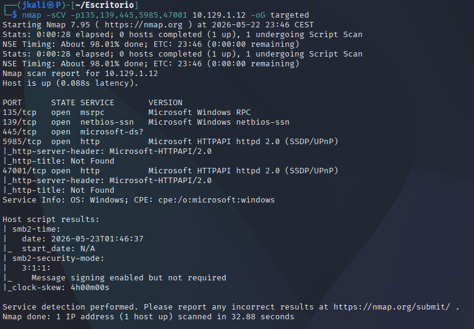
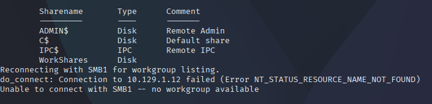

Welcome to my writeup version of the HTB machine Cap.


# Enumeration

## NMAP

I start with nmap to see what ports are open and what services are running:


Now lets see deeper information about versions and services.



```
135/tcp   - RPC      - Windows internal communication, not directly exploitable
139/445   - SMB      - File and printer sharing, high potential for enumeration
5985/tcp  - WinRM    - Windows Remote Management, allows remote command execution
47001/tcp - WinRM    - Alternative port for WinRM
```
With this information, the most obvious one is the SMB.

## SMB

>SMB (Server Message Block) is a network protocol that allows sharing files, printers, and other resources between computers within a network.

```
smbcclient -L <ip> -N
```
