Welcome to my writeup version of the machine Kobold


# Enumeration

## NMAP

Let's start with a nmap to list all the ports open and the services which are running in them.

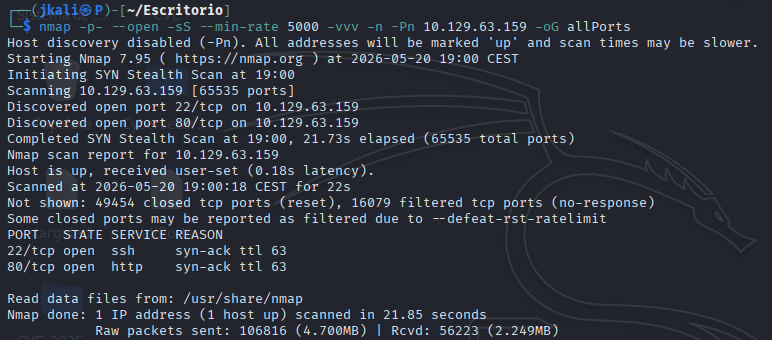

Then about the services

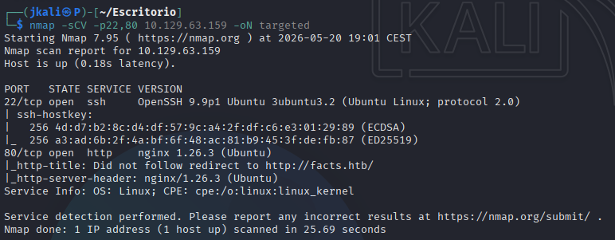

- We have a port 22 ssh that we'll be looking at later on.

- Ports 80/443, http/https service, redirect to "facts.htb", therefore we edit the /etc/hosts file with.

## HTTP

At first we encounter a simple web page on port 80.

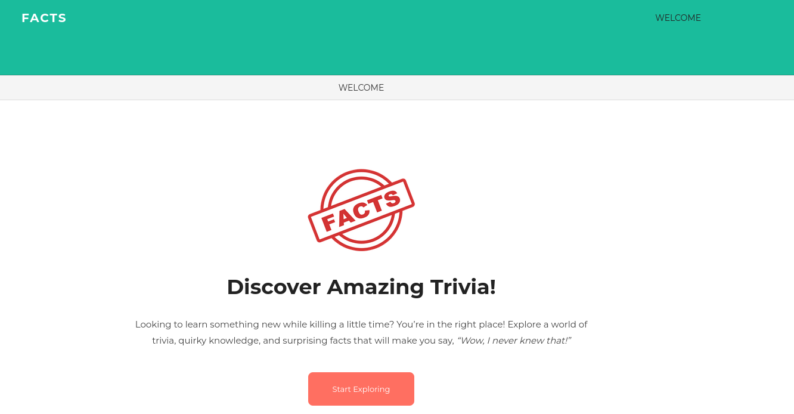
>This one is shown when either enter the page or press "Facts"

Then if we try "welcome" it changes the size.


After pressing on "start exploring", another page will open, containing a fact and some comments down below:


In the middle there is a small field with a path, going back to "page", allows us to see all of the facts available.

## Directory Enumeration

Seeing that there were a lot of directories and nothing to be found anywere else I went for a directory enumeration:

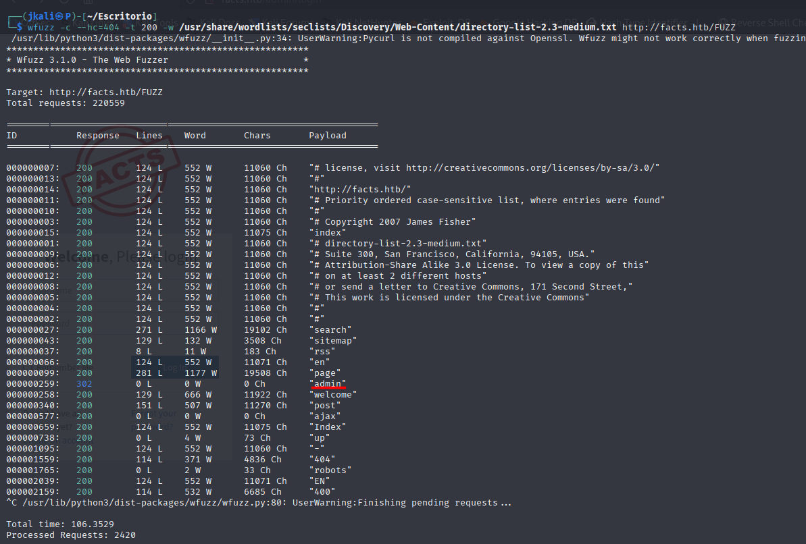

where I found a directory "admin", which led to a login:

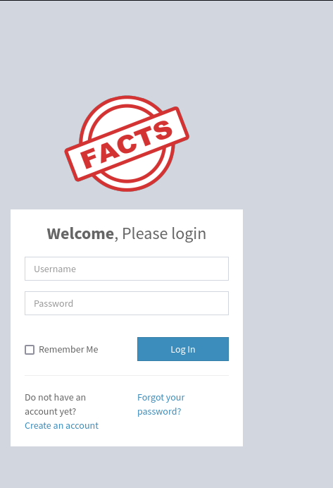

I couldn't get throug with an SQLi, therefore I looked into the other options

- <u>Forgot your password?</u>:  
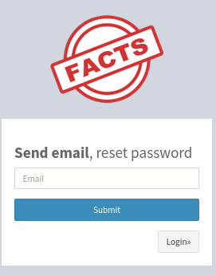

Which I do't plan on using now.

- <u>Create an account</u>:  
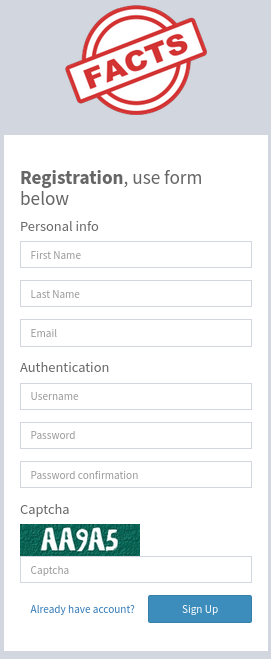

Wich we'll be doing with a simple test:test credentials.

After loging in we're presented with an admin panel on the dashboard.

On the botton of the page we'll find the version and the kind of service we are dealing with.

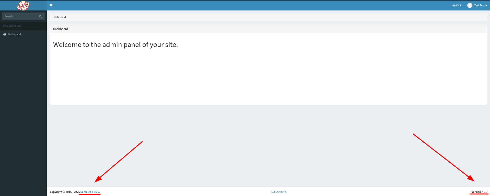

Also on the top righ we'll find a profile page

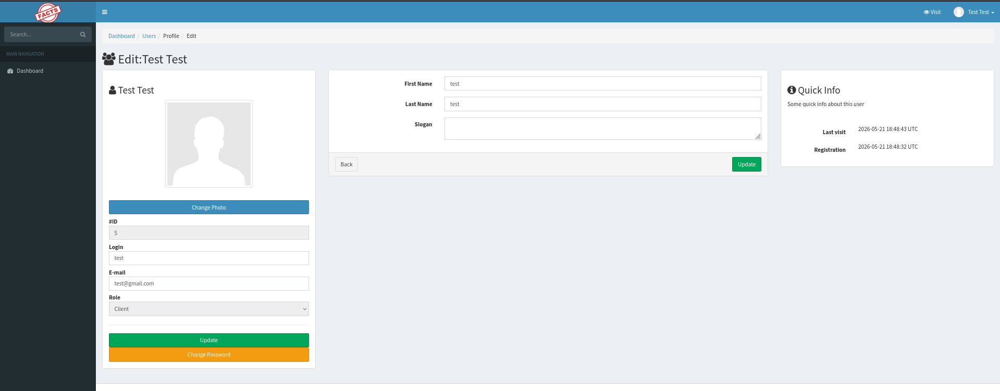

With everything listed lets search for information on Cameleon CMS v2.9.0

After a quick search I found [CVE-2025-2304](https://github.com/Alien0ne/CVE-2025-2304.git), which had a script for a Authenticated Privilege Escalation or role change on its PoC.

## CVE-2025-2304

Using the script as shown on the PoC:

```
python exploit.py -u http://facts.htb -U test -P test -e -r
```
We should have the following result:

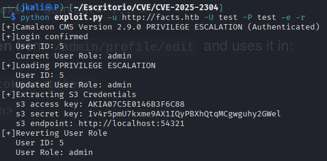

which would mean that we now have access to admin tools on the dashboard.

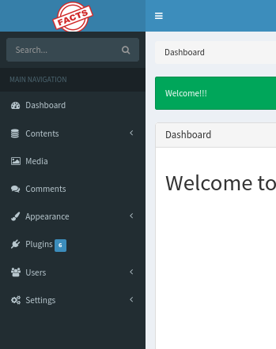

And we do.

## AWS Enumeration

Lets enumerate with aws and search for information

First stablish the aws configuration:

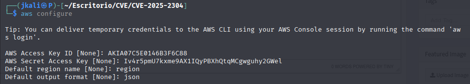

Then search for posible endpoints:

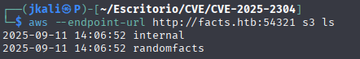

Between those 2, we already know what kind of information the endpoint "randomfacts" may have. Therefore we go for "internal".

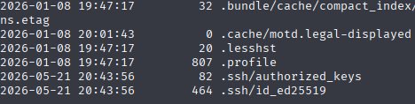

There it is, ssh key for the port 22.

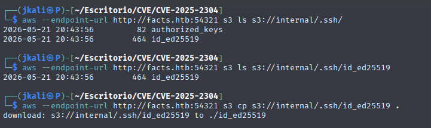

## SSH

After downloading the ssh key, we open it to see if it downloaded as its suposed to.

```
cat id_ed25519
```

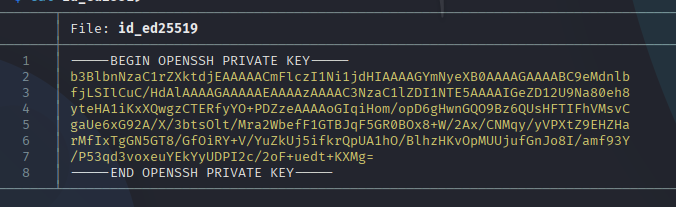

It seems to be just fine.

Now lets try to access through port 22.

Prepear the file with `chmod 600 id_ed25519` and then go for the ssh:

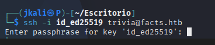

But it turns out its asking for a passphrase. Looking into it, the key should have the phrase too.

```
/usr/share/john/ssh2john.py id_ed25519 > hash.txt

john --wordlist=/usr/share/wordlists/rockyou.txt hash.txt
```
And the result is `dragonballz`.

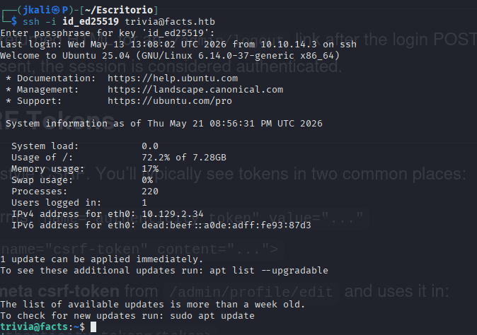

And we got it!

#  Privilege escalation

The first thing I try after getting to the port 22 is `sudo -l`:

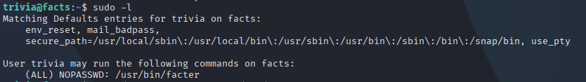

Which can be seen on GTFOBins to exploit.

>Also I searched for other users, and "William seems to have the user.txt with the flag.

On [GTFOBins](https://gtfobins.org/gtfobins/facter/) we'll that the suddoer allows us to execute with privileges the first file .rb on the directory specified.

## /facter

```
TF=$(mktemp -d)
echo 'exec("/bin/bash -p")' > $TF/x.rb
sudo /usr/bin/facter --custom-dir $TF x
```
And we are root!!

Only thing left is to go for the flags.


