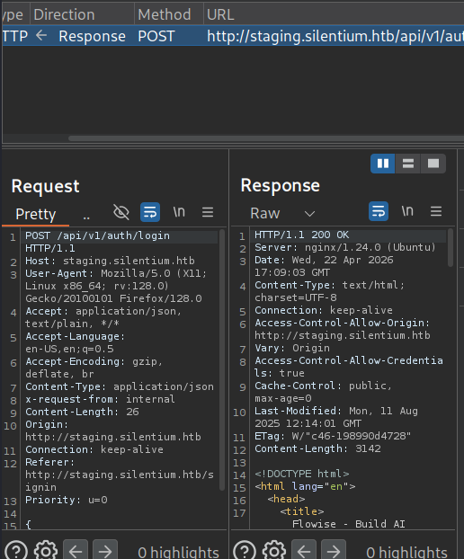
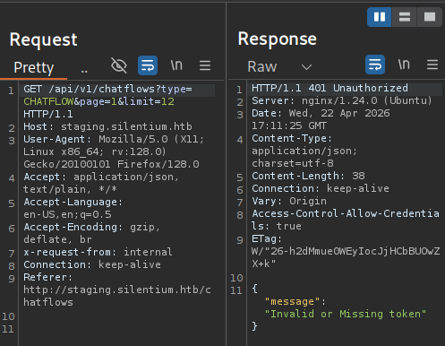
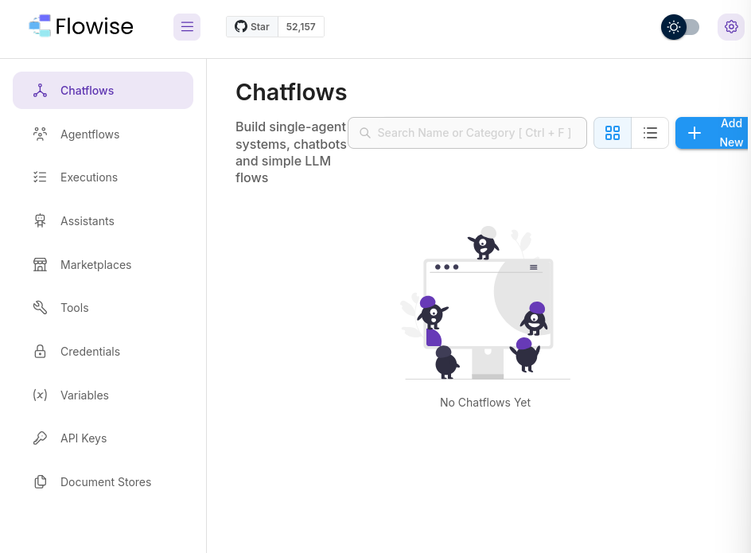
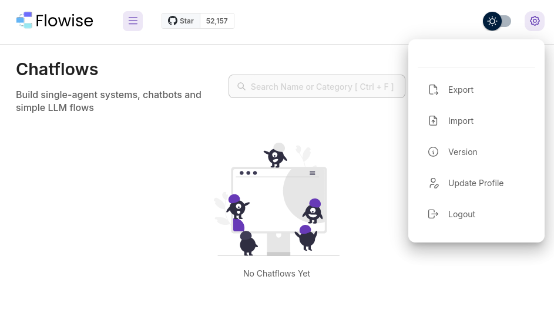
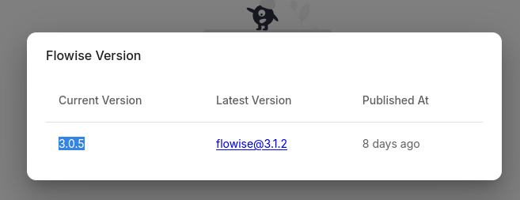
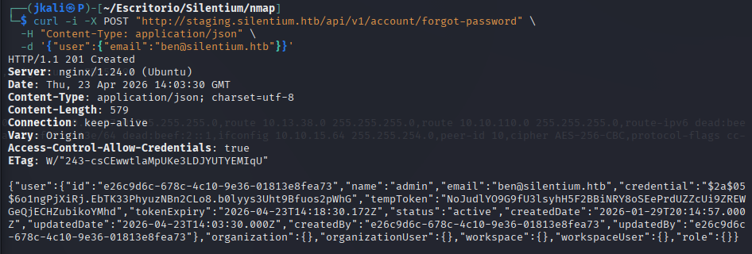
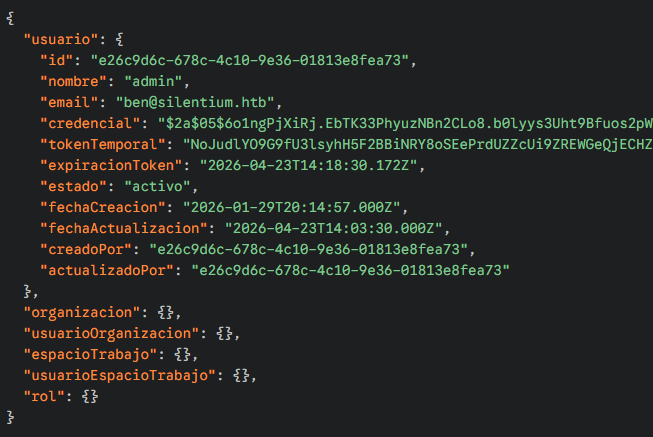
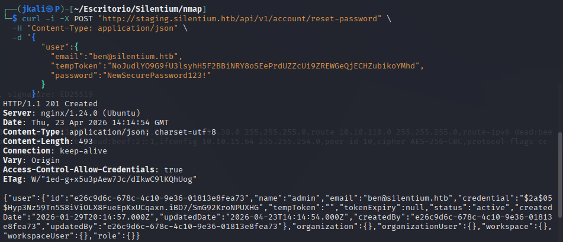

Welcome to my writeup version of the machine Silentium


# Enumeration

## NMAP

I start with nmap to see which ports are open and which services are running.


And another one to see more information about each port and service


There are two open ports: 22, 80

As usual, we'll modify the ```/etc/hosts``` file to acces the http.

## HTTP

We are presented with a web page with diferent sections.


At first, the only section that we can interact with is calculator.


Seeing that we cannot find anything on this web page, lets search for subdomains.

### Subdomain Enumeration
After a quick search with <strong>wfuzz</strong>, we'll find a subdomain ```staging.silentium.htb```


Which looks like a loggin


### HTTP Subdomain

We can see that this login has got two compulsory fields(Email & Password).

I tried to use diferent tactics to aproach this barrier(SQLi, fake credentials, etc.) but it turns out the only thing you need is to press "login" to acces the page.

After trying to acces the page, the page redirects you to the login we were before. Seeing this I decided to hop on Burp Suite to see what was going on:

By intercepting the response of the server



It can bee seen that at first its giving us an ```200 OK``` response. But then:



While trying to load the rest of the page we recive an ```401 Unauthorised``` code.

It ocurred to me that by droping this response I would be able to operate the page freely, and I was almost right. By doing this, some features would be at disposal, but others would redirectme to the login or not even load properly.

Once you've accesed the page there are different things to point out.

First, this is a Flowise page(something I couldn't check with neither Wappalyzer nor whatweb).

Second, the page is composed of two menues.

On the left, with different features:


>If we try to use any of them, we will be redirected to the login.

And the one on the right, which seems to be a configuration menu.



As I saw the option to see which version the flowise was operating I went straight to it.


>Along operating this menu and the rest of the page, we must be carefull(for now) because any wrong move will get us redirected to the login. Preventing this by droping the right responses on Burp will prove esential.

Now, that we now the version, lets check for compatible exploits.

Flowise 3.0.5 is affected by different exploits. Between them, CVE-2025-58434 (Unauthenticated Account Takeover) seems the right choise, considering it depends on the /fotgot-password endpoint inside the api.

Following the instructions on the exploit repository I found(https://github.com/advisories/GHSA-wgpv-6j63-x5ph), the only thing we need is a victims email.

```
curl -i -X POST "https://<target>/api/v1/account/forgot-password" \
  -H "Content-Type: application/json" \
  -d '{"user":{"email":"<victim@example.com>"}}'
```

Following the logic of HTB I decided to try for emails with "@silentium.htb" as domiain.

In the principal page, there are three names which we could try before using another enumeration method:


Usually, in HTB machines, the username "ben" is related to sensible information and vulnerabilities. Therefore thats the first one we'll try.



<strong>It worked!</strong>

Through IA I found the following:



Now with the 'tempToken' lets try a password reset:



ONGOING...