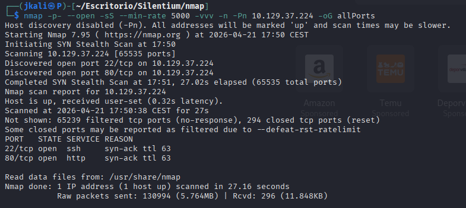
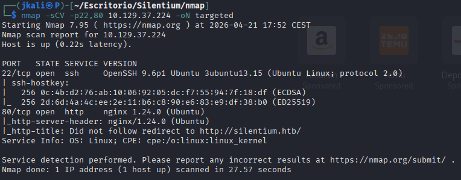
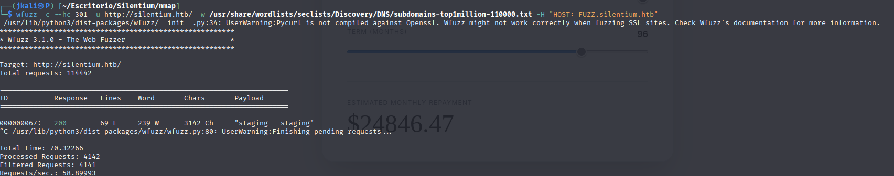
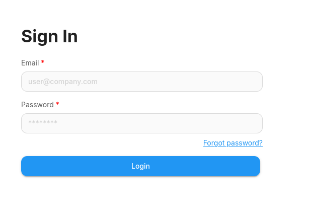

Welcome to my writeup version of the machine Silentium


# Enumeration

## NMAP

I start with nmap to see which ports are open and which services are running.



And another one to see more information about each port and service



There are two open ports: 22, 80

As usual, we'll modify the ```/etc/hosts``` file to acces the http.

## HTTP

We are presented with a web page with diferent sections.


At first, the only section that we can interact with is calculator.


Seeing that we cannot find anything on this web page, lets search for subdomains.

### Subdomain Enumeration
After a quick search with <strong>wfuzz</strong>, we'll find a subdomain ```staging.silentium.htb```



Which looks like a loggin



ONGOING...