Welcome to my writeup version of the machine "Two Million".

# Enumeration

## NMAP

I start with an nmap to see which ports are open:

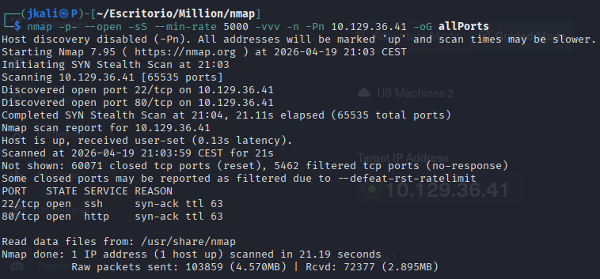

Then I go with the second nmap to list wich services are running on each port and its version:

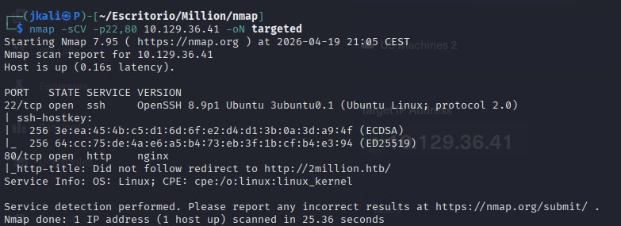

We can see an HTTP and a SSH running.

## HTTP

It seems that searching the web page by the ip addres on the url doesn't work. In the nmap qe can see that the ip adress gets redirected to a web page called "2million.htb". To solve this problem lets change the /etc/hosts file:

Once opened with 'sudo nano /etc/hosts'(because we need root to change this file), we add at the botton of the file:

"[ip] 2million.htb"

Now it should redirect the ip on to the webpage:

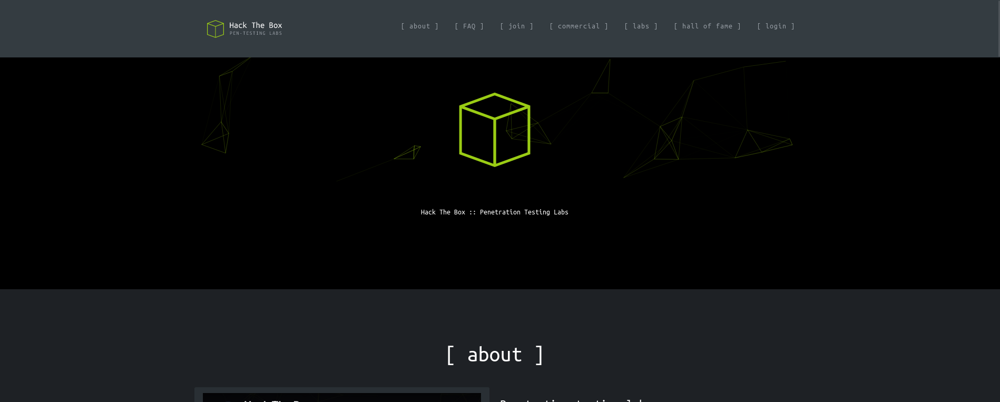

Got it, lets see what we can find.

On top we can apreciate there are different parts on the page(about, FAQ, join, commercial, labs, hall of fame, login).

<u>Login</u>:

After a quick test on the login with OR 1=1 ' attack, I can see that there is no SQLi on it.

<u>Join</u>:

The next interesting section is "join". We are presented with a button that challenges us to hack the invite process.

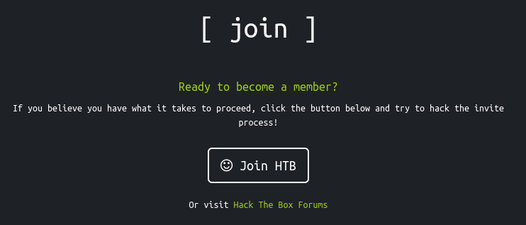

By clicking it we'll be directed to the "Sign Up" page(There is also a link on the faq section on 'here').

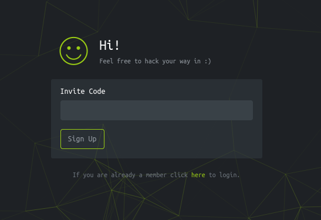

Now that we now there is something to hack on the "invite process", lets see how the web works on the background.

Looking at the source code

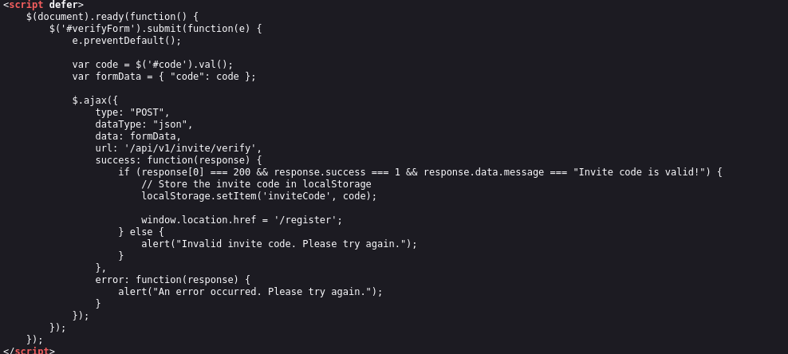

We can see that there is a script in JavaScript which checks if the code is right.

This script is basically making a POST request to '/api/v1/invite/verify', to verify if the code is correct.

There is also another important script being loaded on to the web page, inviteapi.min.js.

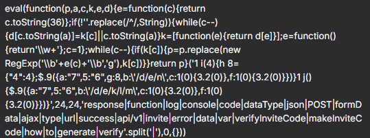

This script is obfuscated, with almost any AI or other tools we can deobfuscate the code.

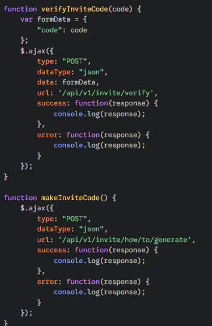

<strong>Now</strong> we have something interesting. There is the method that obtains a valid code.

Lets jump to the terminal and obtain that code.

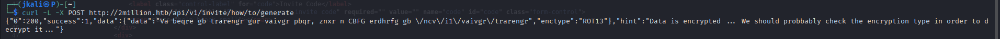

The response mesasge gives us a line of code encrypted un ROT13.

With a ROT13 decoder the result comes out as:

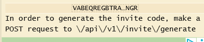

Curl to that directory:

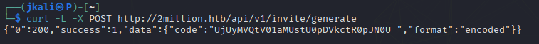

We get a valid code that seems to be encrypted in base64.

Use the valid code to create a new "test" account

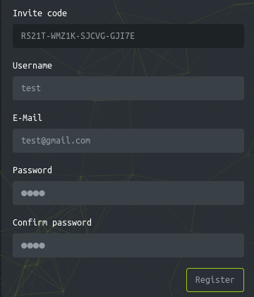

Then register...

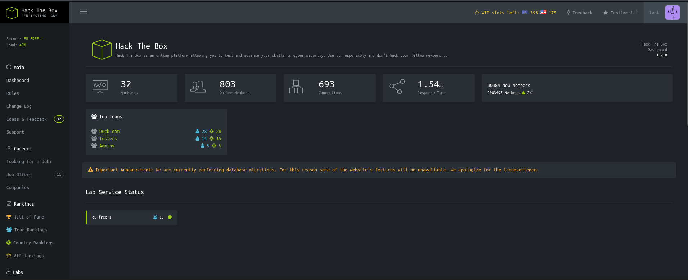

Once logged in, we are presented with a HTB page.

On the left side there is a menu, from all the options only 4 are features(Dashboard, Rules, Change Log, Acces).

Between the functional features, actions seems to be the most interesting one.

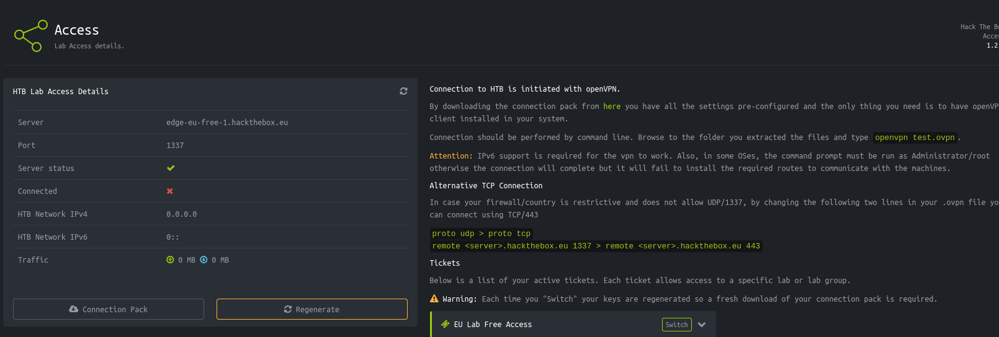

The acces feature comprehends of a connection pack generator qhich can be regenerated. Each time we press each button, a '.ovpn' gets downloaded.

Lets see what kind of curl does the button on the background.

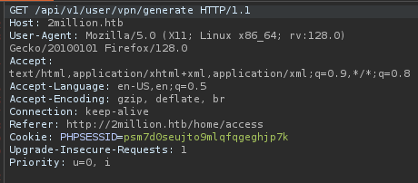

It can bee seen that the button sens a petition to the api so it sends the vpn file. 

Seeing that there is an accesible api behind(as we proved before whith the acces-code) we could try to procede with an <strong>api enumeration</strong>.

## API Enumeration

On investigation...